# Troubleshooting Digital Gardens
{: .no_toc}

{: .reminder}
>  Free software isn't free. Support Ole, the Digital Garden developer: [Buy Ole Eskild Steensen a Coffee - oleeskild - Ko-fi](https://ko-fi.com/oleeskild)

{: .success}
> If you find this guide helpful, consider tossing me a coin! [Support WiseGuru](https://ko-fi.com/S6S3TOIAO)

# Table of Contents
{: .no_toc .text-delta}

1. TOC
{: .toc}

{: .reminder}
> **Protect your Domain from Spoofing**
> Even if you don't have email connected to your domain, you should set up SPF and DMARC records for your Digital Garden. Check out [[Protecting your Identity and your Domain with Email Security]] for more details.

# How to ask for Help
If you have gone through the steps below and you're still having trouble, then reach out on the [Digital Garden Discord **Help** Channel](https://discord.gg/Z46n2RNX8e) with the following information:
1. A link to your GitHub repo (if it's public)
2. A link to your site
3. Screenshots or copies of any logs you're seeing

This information makes it much easier to troubleshoot the problem and get you up and running!

# Initial steps - Digital Garden Isn't Deploying

> Below are steps you should take ***BEFORE*** asking for help. ***Following this guide*** will get your site up and running faster, and if you need help, ***will get you better help sooner***.

## 00. The Digital Garden Pipeline
Let's review the publication pipeline for your Obsidian Digital Garden. Each stop is a place to look for typos, warnings, or problems.
1. Create content on Obsidian
	1. Set correct file properties
		1. *All* pages to be published *must* have `dg-publish` checked.
		2. Exactly **`one`** page must have `dg-home` checked.
	2. Plugins with special in-page code (e.g. Dataview) need to be formatted correctly.
	3. DG Plugin settings are managed in Obsidian>Settings>Digital Garden.
2. Publish content from Obsidian to Github
	1. Use the *Digital Garden Publication Center* to identify all pages being changed.
	2. Using shortcuts generates notifications at the top right and bottom right of Obsidian. 
3. GitHub performs a build and pushes content to your host (Vercel, Cloudflare, etc.)
	1. Logs are found under the *Actions* tab.
	2. Any changes made in the repo (e.g., custom headers and plugins, software package updates, etc.) can be reviewed and reverted.
4. Your host builds the site and publishes the content
	1. Cloudflare logs are found in Computer (Workers)>Workers & Pages>View Details.

## 01. Verify that your pages in Obsidian have the correct properties

**Only one** page should have the property `dg-home` checked, and it also *must* have the `dg-publish` property checked. You can add these properties a couple of ways:

### Option 1: Through the Obsidian Command Palette
Open the Obsidian *Command Palette*, search for **Digital Garden**, and select the "Digital Garden: Add publish flag" command.

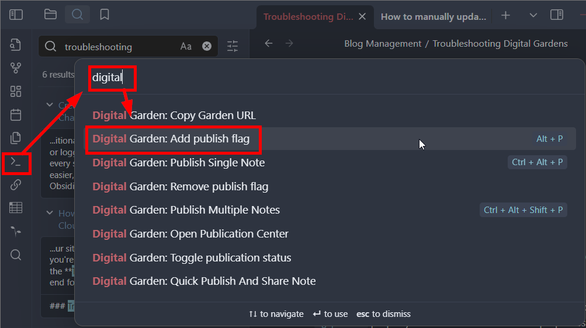
If you do not have a `dg-home` property set, you can manually change `dg-publish` to `dg-home` and then add another publish flag to the sheet.

### Option 2: Manually add the properties
1. Select the three-dot menu at the top-left of your note, and click "Add file property..."
	1. 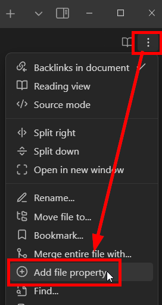
2. Name the property either `dg-home` or `dg-publish`
	1. 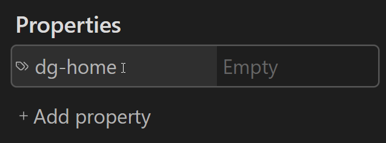
3. Select the icon to the left of the name, and change the "Property Type" to *Checkbox*
	1. 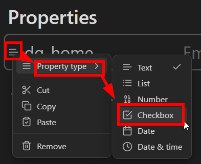
4. Check the box to enable the property, uncheck the box to disable it.
	1. 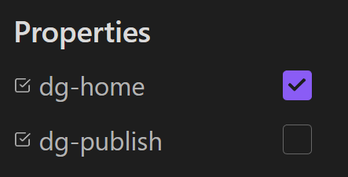
		1. With *this configuration*, the note is set as the home page, *but* will not be published to the Digital Garden, and *will result in a failed deployment.*
		2. Both `dg-home` and `dg-publish` need to be checked on the homepage.

> **Again**, go through your pages and make sure **only one page is set with** `dg-home`, and **every page you want published** is marked with `dg-publish`

**If you made any changes,** publish your *homepage* using the *Command Palette* or the *Digital Garden Publication Center* and check your site.

{: .note}
>Be careful when unchecking the `dg-publish` tag or moving many pages. Uploading multiple pages counts as one commit, but *deleting or moving multiple pages counts as one commit per page*. If you have a large site (100+ pages), you can quickly run out of available free commits.

If your site doesn't update, or your pages are marked correctly, proceed to the next step.
## 02. Check your GitHub Repo to make sure its populating
Log into your *GitHub* account, open your repository, and check `src/site/notes` to see if it's populated with any of your notes.
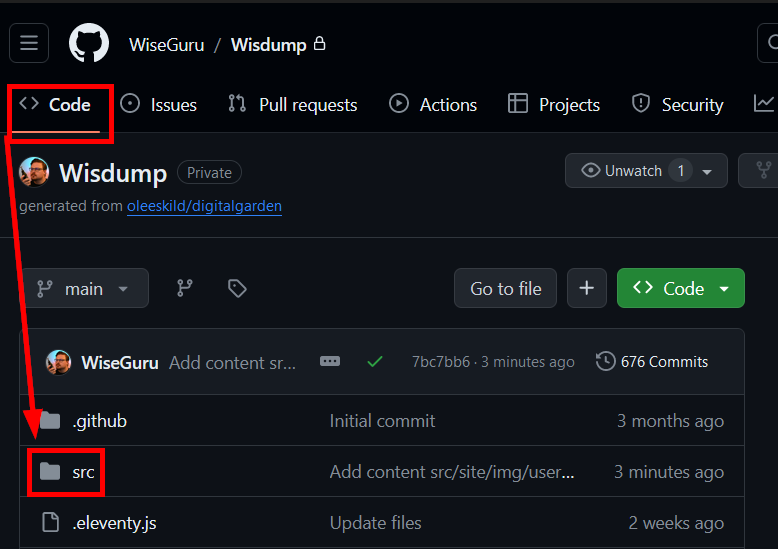
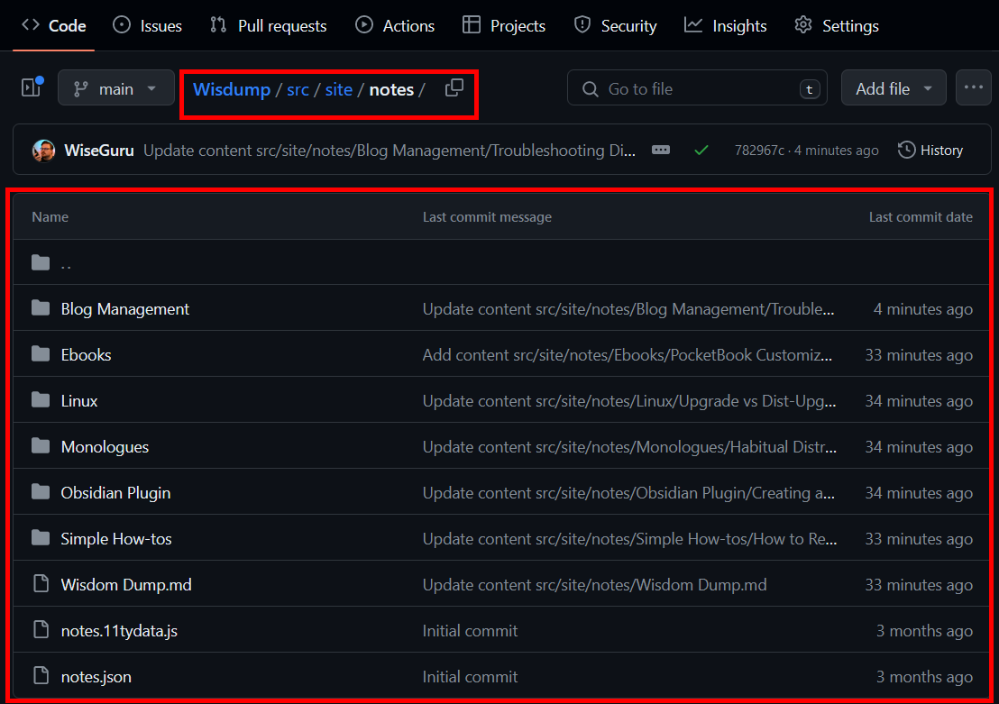

If it's not populated, it means GitHub is not receiving your notes, and this is likely caused by a **fine-grained token** misconfiguration, so let's just rebuild it from scratch.

{: .note}
>Even if you see a green checkmark in the Digital Garden plugin in Obsidian, that only checks if the token is *legitimate*, not that it has the correct permissions.

{: .warning}
>The tokens are only visible *immediately after creation or regeneration*, and if you do not copy/paste it before you navigate away from the page, you will have to regenerate it.
>This is not the end of the world, just a *douleurs dans le cul*, as Google Translate tells me the French say

Here's [Ole's guide on creating a token from his site](https://dg-docs.ole.dev/advanced/fine-grained-access-token/), but let's go through each step below.
1. Go to [this page](https://github.com/settings/personal-access-tokens/new) to configure the token.
	1. You can also manually navigate there by selecting your Profile icon at the top right, then *Settings*, then *Developer Settings* at the bottom of the left column, expand *Personal access tokens*, and then select *Fine-grained tokens*, and click **Generate new token**
2. Enter the following information:
	1. Token name
		1. This is for your reference, and must be unique among *your* tokens
	2. Expiration date
		1. Default is 30 days, drop-down menu allows you to select up to 90, but you can manually configure up to 1 year
	3. Description
		1. Again, up to you
	4. Repository Access
		1. Click the radio button for "Only select repositories" and choose your Digital Garden repository
3. Expand *Repository permissions* and configure the following permissions
	1. Contents
		1. Read and write
	2. Pull Requests
		1. Read and write
	3. **NOTE**: "Metadata" will automatically change to "Read-only", and this is correct and good.
4. Click *Generate token*
	1. *Immediately* copy and paste this token into the Digital Garden plugin in Obsidian, *before* navigating away from the page.

Once the new token has been added, publish your *homepage* using the *Command Palette* or the *Digital Garden Publication Center* and check your site.

If your site doesn't update, but you are seeing your notes in GitHub, proceed to the next step.

## 03. Check the build and Gather Logs
Will add details later, but for now, check these three things:

1. You are publishing to the "Main" branch by default
	1. [Changing the default branch - GitHub Docs](https://docs.github.com/en/repositories/configuring-branches-and-merges-in-your-repository/managing-branches-in-your-repository/changing-the-default-branch)
	2. 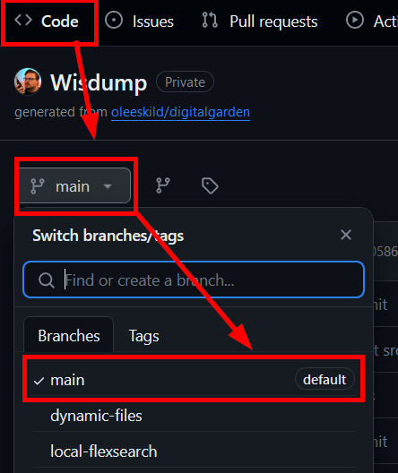
2. In GitHub, got to the *Actions* tab and look for Errors
	1. 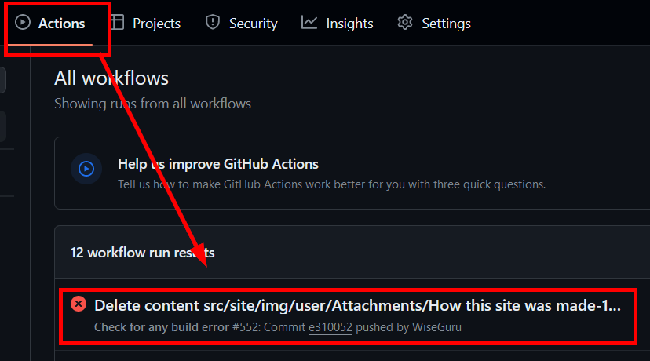
	2. 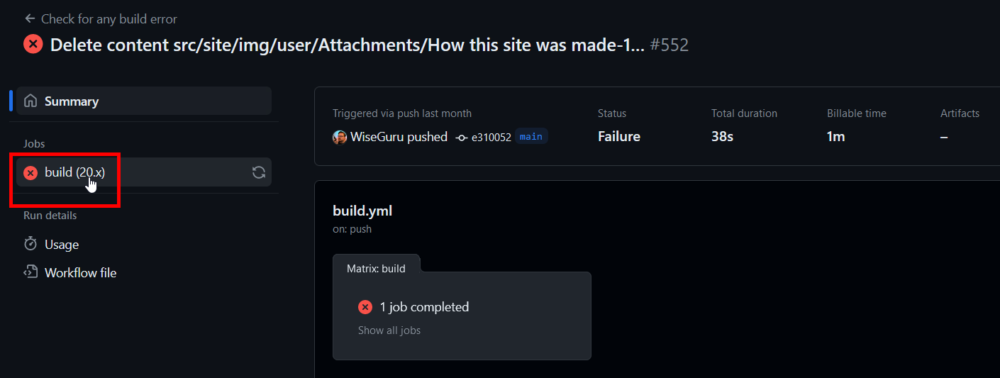
	3. 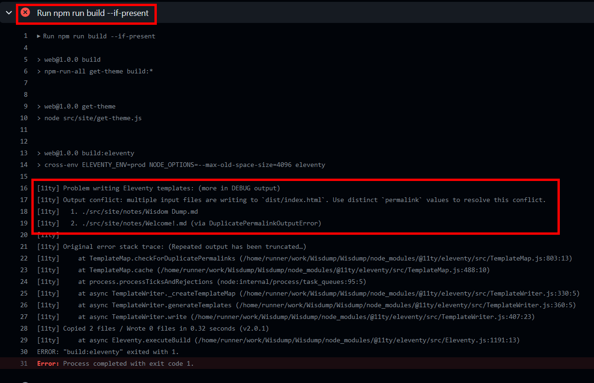
		1. If you see errors like this one, it means there are duplicate files in your repo or two pages marked with `dg-home`.
3. Host (Vercel, Cloudflare, etc.) logs
	1. These logs will look similar to the ones in GitHub.
	2. [Vercel](https://vercel.com/docs/deployments/logs)
	3. [Cloudflare Pages](https://developers.cloudflare.com/pages/functions/debugging-and-logging/#view-logs-in-the-cloudflare-dashboard)

### 11ty error troubleshooting
If you're getting an 11ty error during the build, you may have 2 or more files with `dg-home` set to *true* or pages with duplicate names/links.

The first 5 or so lines of the 11ty output contain the information you want.

#### Sample Log; Duplicate Files
In this case, I have a problem with the file "Do I have ADHD?" which was originally uploaded from a Windows machine (which does not allow a `?` in the file name) and then a Linux machine, which has no problem with question marks in file names.

DG formatted their URLs the same way, and there was a build error.
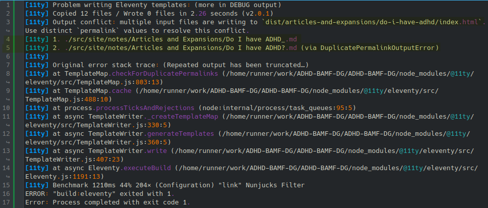

Depending on the issue, you may need to manually delete the file from your GitHub Repo or Obsidian. If the issue is a syntax problem (like above) and you did a "Publish All" command, then the problem should resolve itself when it deletes the (now missing) file and rebuilds the site.

#### Sample Log; Multiple Homepages
As an example, I set two pages to have the `dg-home` page checked; it references `dist/index.html` in the second line, indicating two or more files writing to `dist/index.html`, which is the home page.

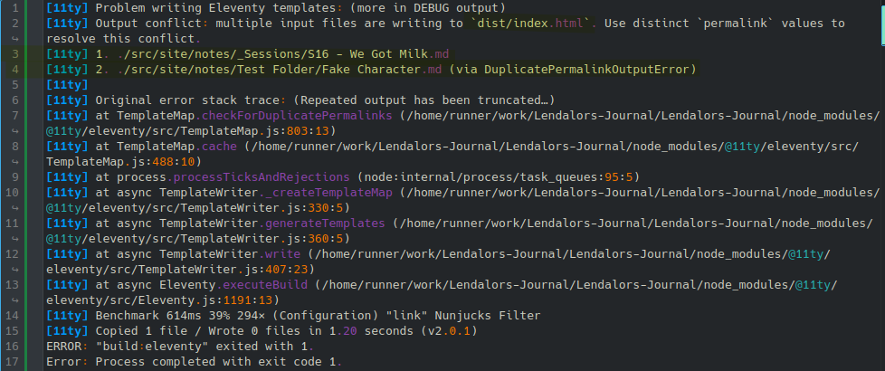

While the log tells you which files are being problematic (in this case, "S16 - We Got Milk" and "Fake Character"), you can also use a Dataview table to find and review all published files.

Create a Dataview codeblock and copy/paste the code below into it. This will generate a full list of all published pages with any page that has a configured `dg-home` home attribute at the top, and then is sorted by file name (which can help to identify duplicate files with slight name differences).

```
TABLE dg-home, dg-publish
WHERE dg-home=true OR dg-publish=true
SORT dg-home DESCENDING, file.name
```


# Common Problems
## feed.xml experiences an "XML Parsing Error"

{: .warning-title} 
> *WARNING*: Out-of-Band Patch
> 
> This is a patch to template-managed code, and *will be overwritten* when the plugin updates.

I discuss this in [[Fixing-the-RSS-Feed]], but basically, the script `/src/site/feed.njk` is not closing links properly when generating the file. It needs lines 10, 11, and 26 to be updated to use 5 slashes (`/`) instead of 4.

## Filetree disappears or collapses when you click a folder
This happens because a folder name has an illegal character in it, most likely an apostrophe. The offending folder will likely also be fully expanded.

Remove any special characters from folder names, republish the site, and work forward from there.

## You see a bunch of Failed deployments in Cloudflare to "Filetree"
1. This probably only happened if you included the branches from the template
2. Make sure the *Main* branch is set as "Default" in GitHub

## First time publishing Garden stuck on "Calculating publication status from GitHub"
This is caused by the fine-tuned GitHub Token not being configured with the correct permissions. You will need to recreate the token following these steps: 

undefined

Once complete, the token permissions should be summarized on GitHub like this:

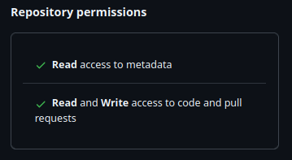

## Obsidian Properties Passthrough and Nunjucks Scripts
Scenario: You are trying display multiple Aliases (or other Obsidian Properties) on your notes. You've followed [Ole's guide on adding custom components](https://dg-docs.ole.dev/advanced/adding-custom-components/), and you've copied [uroybd's 001-aliases.njk](https://github.com/uroybd/topobon/blob/main/src/site/_includes/components/user/notes/header/001-aliases.njk) script into your repo in the right place, but nothing happens. This is because *Digital Garden does not inherently pass through all frontmatter* on a page; so the script you've copied has nothing to work with.

There are two possible solutions, but be careful; if your Nunjucks script is busted, your site won't deploy properly.

1. Enable the Digital Garden feature "*Let all frontmatter through*"
	1. This is mostly listed as a warning; enabling this without fully understanding the implication will likely break your site.  
2. You need to add the property `dg-pass-frontmatter` to each file you want the script to work on
	1. Other properties (like aliases) will be passed through to the Repo, and the `njk` script will be able to work with them.

## Manually updating packages for your Digital Garden broke something
You've [[How to manually update packages for Digital Gardens|manually updated packages in your repo]] and now something's busted:
undefined

## Build failure with htmlMinifier and HTML content in logs
When you try to publish your page, you get an error that looks like this: 

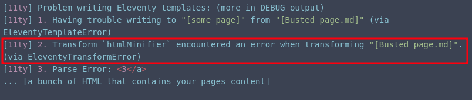

This is caused by `htmlMinifier` interpreting a character on your page incorrectly and failing to render the page properly.

From my testing, the `<` character in titles, headers, and some code blocks (like Mermaid with bi-directional arrows `<-->`) cause problems, but it may cause problems elsewhere too. Using the entity name (e.g., instead of `<3`, doing `&lt;3`) didn't solve the problem.

This is similar to the disappearing filetree issue, as it's the special characters `'` and `"` in titles that cause it not to render properly.

|Character|Entity Name|Entity Code|
|---|---|---|
|`<`|`&lt;`|`<`|
|`>`|`&gt;`|`>`|
|`&`|`&amp;`|`&`|
|`"`|`&quot;`|`"`|
|`'`|`&apos;`|`'`|

The only solution so far is to either disable `htmlMinifier` in the `.eleventy.js` file in your Digital Garden repo or remove the offending character.

{: .warning-title} 
> *WARNING*: Out-of-Band Patch
> 
> Commenting out htmlMinifier from .eleventy.js modifies template-managed code, and *will be overwritten* when the plugin updates.

To remove htmlMinifier, open `.eleventy.js` in your favorite text or code editor, and add a `//` to the beginning of every line in the "htmlMinifier" section.

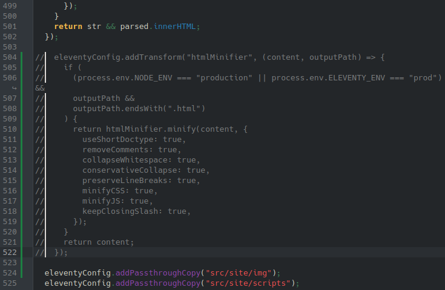

Since I'm using [Kate](https://kate-editor.org/), I can drop the cursor at the beginning of the top line, press and hold **Ctrl + Alt**, and then use the arrow keys to drop the cursor to all subsequent lines. Save your changes then push the repo up.

## Created or Updated Date and Time not Appearing
You've set a manual date and time for each page you want to publish, but they are not showing up.

Most likely, you do not have the correct timestamp value in your file's frontmatter. When setting your own values, you create a frontmatter key (which can be anything you choose), but you *must* set the time values in the files using the ISO-8601 standard.

The standard is `YYYY-MM-DDTHH:mm:ss.sssZ`,^[[JavaScript Date toISOString() Method](https://www.w3schools.com/jsref/jsref_toisostring.asp)] ^[[luxon/docs/formatting.md at master · moment/luxon · GitHub](https://github.com/moment/luxon/blob/master/docs/formatting.md#table-of-tokens)] where `T` marks the difference between date and time (though it could also just be left as a space).

For example, if you added the following creation date `2025-05-28 23:59:58.024` to a file and you set the timestamp format in your plugin settings as `HH:mm, MMMM dd yyyy`, your page would show "23:59, May 28 2025" below the header.

You only need data up to the most granular time you want. If you wanted to only show the date, you would just `YYYY-MM-DD`, or the to minute, just `YYYY-MM-DD HH:mm`

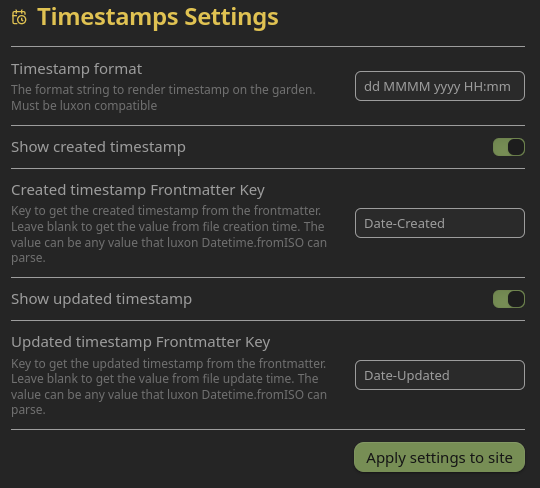
> Timestamp Settings in the Digital Garden plugin

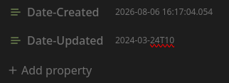
> Frontmatter values formatted in ISO-8601

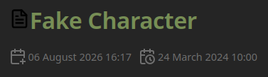
> Published page showing the created date and times.


## Missing Menu and Search icons in Firefox
When the sidebar is hidden, the hamburger menu icon at the top left and the magnifying glass in the search bar in the top right are missing, as seen in the example below.

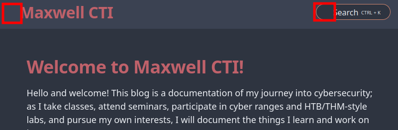

This is caused by a bug in Digital Garden where the lucide icon library isn't loaded before it's called to generate the icons. This can be fixed by updating the script in `src/site/_includes/components/lucide.njk` to the following:

{: .warning-title} 
> *WARNING*: Out-of-Band Patch
> 
> This is a patch to template-managed code, and *will be overwritten* when the plugin updates.

```html
<script defer src="https://unpkg.com/lucide@latest"></script>
<script defer>
  document.addEventListener('DOMContentLoaded', () => {
    lucide.createIcons({
      attrs: { class: ['svg-icon'] }
    });
  });
</script>
```

This updated coad loads the lucide icon library before the script calling the icons, and defers all of it until after the rest of the site has loaded (to ensure it doesn't prevent other components from loading). 


**References**
* Lucide UMD usage: [https://lucide.dev/guide/packages/lucide](https://lucide.dev/guide/packages/lucide)
* `defer` attribute on `<script>`: [https://developer.mozilla.org/docs/Web/HTML/Element/script#defer](https://developer.mozilla.org/docs/Web/HTML/Element/script#defer)
* `DOMContentLoaded` event: [https://developer.mozilla.org/docs/Web/API/Window/DOMContentLoaded\_event](https://developer.mozilla.org/docs/Web/API/Window/DOMContentLoaded_event)


## ITS Theme Callouts Not Formatting Correctly
The ITS theme allows the creation of right- or left-justified infobox callouts. These callouts should appear to the right or left of text, but sometines are not when published to Digital Gardens.


This is commonly caused by the theme settings not being synced with Digital Garden, which can be done in Obsidian by going to Settings>Community Plugins>Digital Garden>Appearance, and then applying theme settings at the top.


