I've created a few sites using Ole's [GitHub - oleeskild/digitalgarden](https://github.com/oleeskild/digitalgarden) and [Cloudflare Pages](https://pages.cloudflare.com/). When I was first getting setup, there were precious few guides out there on the matter, and nothing that was very concise or straightforward. 

To that end, I've created this guide on configuring *Cloudflare* as a host for your *Digital Garden*

## Table of Contents
- [Steps to Publish Cloudflare](#Steps%20to%20Publish%20Cloudflare)
	- [00. Prep-work](#00.%20Prep-work)
	- [01. Setup GitHub Repository and Access Token](#01.%20Setup%20GitHub%20Repository%20and%20Access%20Token)
	- [02. Configure Obsidian Plugin and Pages](#02.%20Configure%20Obsidian%20Plugin%20and%20Pages)
	- [03. Configure Cloudflare](#03.%20Configure%20Cloudflare)
	- [04. (OPT) Register and Assign a Custom Domain](#04.%20(OPT)%20Register%20and%20Assign%20a%20Custom%20Domain)
	- [05. (OPT) Configure Dependabot on GitHub and Create Custom Headers](#05.%20(OPT)%20Configure%20Dependabot%20on%20GitHub%20and%20Create%20Custom%20Headers)
- [Troubleshooting](#Troubleshooting)
- [Other Resources and Honorable Mentions](#Other%20Resources%20and%20Honorable%20Mentions)
## Steps to Publish Cloudflare

### 00. Prep-work
In order to complete this project, you will need the following:

1. Install the [Digital Garden plugin](obsidian://show-plugin?id=digitalgarden) on your [Obsidian app](https://obsidian.md/)
2. Create a [GitHub](https://github.com) account if you don't already have one.
3. Create a [Cloudflare](https://dash.cloudflare.com/login) account.

### 01. Setup GitHub Repository and Access Token
Now that you've got your accounts in order, you need to use the [Digital Garden Repo](https://github.com/oleeskild/digitalgarden) Template to create your site's repo.
#### Create the Repo
Go to [this repo](https://github.com/oleeskild/digitalgarden), click "*Use this Template*," and select "*Create a new repository*"


{: .reminder}
>If you don't see the *Template* button, you may need to either maximize the page or zoom out.

On the next page, configure the repo as follows:

1. **Do not** check the box to "*Include all branches*"
2. Enter a name and description for the repository
3. Set the repository as *Public* or *Private*
	1. This doesn't have any impact on the function of the site, but you may or may not want to share the page source.
	2. When troubleshooting or asking for help, it is much easier if the repo is Public; however, if you accidentally publish a password and take down the page, someone could go through the repo history and find the password.


>Example configuration for my idea-dumpsite, [wisdump.work](https://wisdump.work/)

#### Create an access token to the Repo for Digital Garden

To connect the plugin with your Repo, you will need to generate a Fine-Grained Access Token from GitHub.^[You could do a regular token, but that's a bad idea and you should feel bad for having it.] Oleeskild also has a guide to create a [fine grained access token](https://dg-docs.ole.dev/advanced/fine-grained-access-token/), though the image is a little compressed.

1. From within GitHub, click on your profile icon at the top-right corner
	1. Select "*Settings*"
	2. In the left bar, select "*Developer Settings*"
	3. In the left bar, expand "*Personal access tokens*" and select "*Fine-grained tokens*"
	4. Click "*Generate new token*"
2. Configure the token with the following information in each section:
	1. Main settings
		1. Token name
		2. Token expiration date
			1. Cannot go further than a year.
			2. Once a token expires, it will need to be regenerated.
			3. IIRC, you can just reactivate the token, but you may need to copy/paste the token back into the plugin.
	2. Repository Access
		1. "*Only select repositories*" and select the repository
	3. Repository Permissions
		1. *Contents*: Read and write
		2. *Metadata*: Read-only (this is set automatically)
		3. *Pull Requests*: Read and write
3. Generate token - **DO NOT EXIT THIS PAGE**
	1. *This is the only time on GitHub that you will be able to see this token!*
		1. If you DID navigate away from this page before copying the token, it's no big deal; you just have to create a new one.
		2. Feel free to save it to your preferred password manager as a backup, but it is also stored in the plugin itself.
4. Copy and paste the token from GitHub into the Digital Garden plugin in Obsidian.
	1. Open Obsidian, go to *Settings*, and in the left column under *Community Plugins* select *Digital Garden*. Enter the Repo name, your user account name, and paste the **Fine-Grained Token you just created**.

### 02. Configure Obsidian Plugin and Pages
Once you've got your Repo and Plugin connected, there are some settings you should adjust in the plugin to further customize your site.

>If you make these changes before you connect to Cloudflare, you might have to re-apply them later. However, clicking "Apply" will make them all take effect at once, conserving the number of builds you use.

#### Configure the Plugin
Nothing here is hard and fast, just some observations I've made:
1. Features
	1. I like turning almost all of the Features on, excluding Frontmatter, which can break the site
2. Appearance
	1. I change the theme to match my current theme so I know what the site will look like
	2. Enter a site name
	3. Assign a favicon
		1. A *favicon* is the little picture in the tab of your browser.
		2. Unfortunately, the favicon needs to be an *svg* file and square, which can be difficult to find or make.
			1. There are some free SVG converters online, so if you already have an image, you could start there.
		3. If you update the Favicon **after** you create your site, you may need to *purge your browser's cache* before you will see it take effect
	4. Add Timestamps to pages
		1. When adding timestamps to your site, you can either use the files built-in metadata or set your own values manually.
		2. When setting your own values, you create a frontmatter key (which can be anything you choose), but you *must* set the time values in the files using the ISO-8601 standard.
			1. The standard is `YYYY-MM-DDTHH:mm:ss.sssZ`,[^1] [^2] where `T` marks the difference between date and time[^3]
				1. For example, you would add the following date to a file: `2025-05-28T23:59:59.024+6`
			2. You only need data up to the most granular time you want. If you wanted to only show the date, you would just `YYYY-MM-DD`, or the to minute, just `YYYY-MM-DD HH:mm`
			3. More details and screenshots are available in [Troubleshooting-Digital-Gardens](../BugsAndFixes/Troubleshooting-Digital-Gardens.md)
		3. **WARNING**: If you have a lot of pages and choose to update this later on, it may update every page as its own job.
		4. **WARNING**: If you use a tool like Resilio Sync or Syncthing to share your vault between computers, it will change the metadata of the file, and you are likely to get unexpected changes to the _Created_ and _Modified_ dates of your files.

If you have any questions about other settings, check out the [Digital Garden guide](https://dg-docs.ole.dev/) or [join the Discord server](https://discord.gg/Z46n2RNX8e)

#### Add Properties to Pages
Now that the plugin has been configured, we can start adding pages to be published. We do this by adding specific *properties* to every page we want to publish, and while there are several properties you can use to configure your pages, there are *two* that are **required** for you to have a functioning site.

1. `dg-home`
	1. You need *exactly one* page with this property set to *True* (or with a *checked box*).
		1. This sets the home page for your site, and you can't have two home pages.
	2. **NOTE**: If you want a title on your homepage, you will have to use a *heading* as the file name won't be visible.
2. `dg-publish`
	1. You need this set to *True* on *every page you wish to publish*, including the home page.

If you don't see a "Properties" section at the top of your page, you can create one in a few different ways:
1. Using three dashes `---` in the first line
2. Clicking the three-dot menu at the top right, and selecting "Add Property"
3. Hitting `Ctrl+;` on your keyboard
4. Opening the *Command Palette*, searching for *Digital Garden*, and choosing one of several options:
	1. Add file property
	2. Add publish flag
	3. Probably others

If you've manually created a *Property*, you need to set it as a *checkbox*.
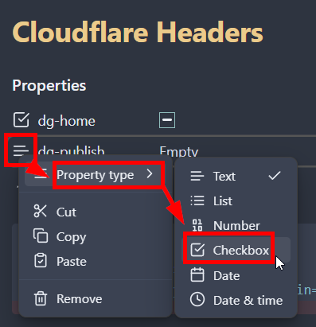

#### Publishing your Site
There are a few ways to publish your site when you're ready.

You could open the *Command Palette* and select *Publish all notes* or *Publish single note*
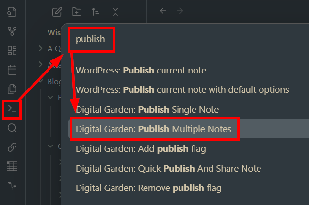

{: .note}
> You can [configure hotkeys](https://help.obsidian.md/Customization/Custom+hotkeys) in Obsidian’s Settings to make publication easier. The combination below is intuitive for me, and doesn’t have any overlapping uses.
> 


Or you could use the *Digital Garden Publication Center* and pick from a more nuanced-selection of options.

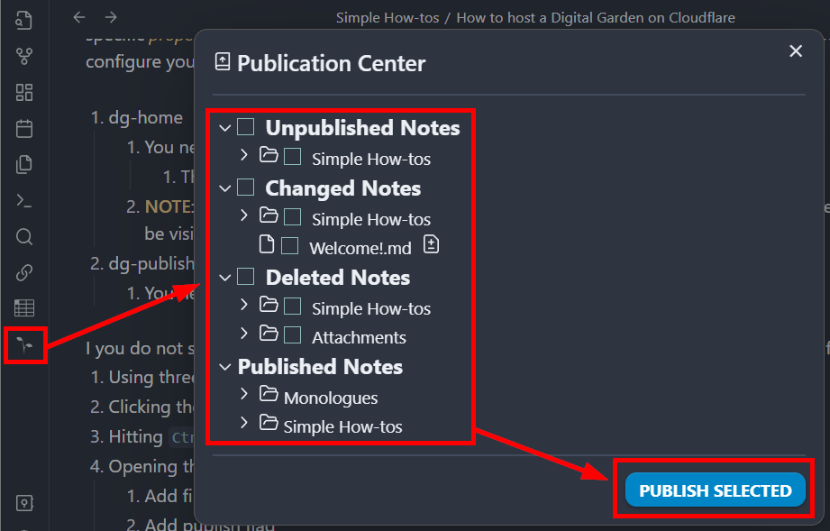

### 03. Configure Cloudflare
Now that your Vault is ready for **Prime Time**, let's get it setup in Cloudflare

#### Create the Pages Application

Log in to Cloudflare, expand the left menu bar, expand *Compute (Worker)*, select *Workers and PAges*, and click *Create*
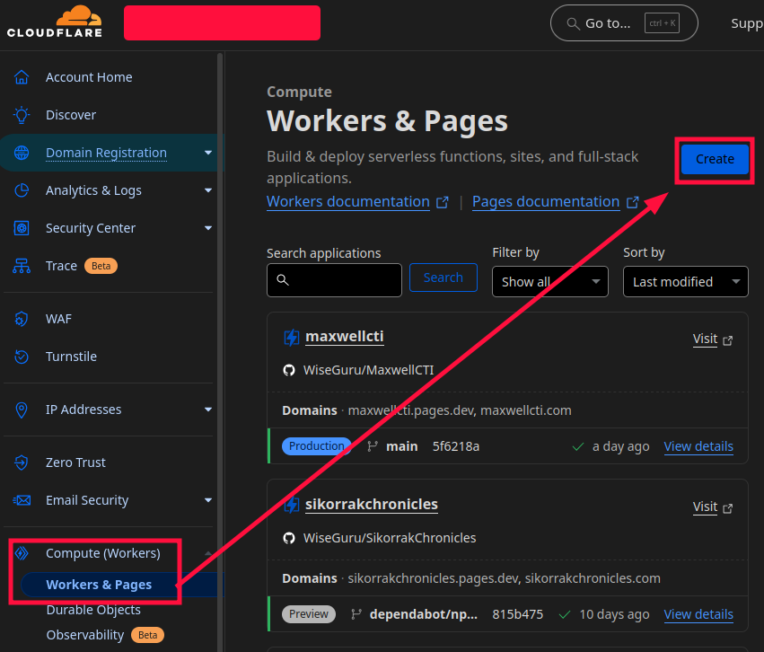

Select the *Pages* tab, then *Get started* next to "Import an existing Git repository" to link your GIT account, and select the Repo you created from the *Digital Garden* template.
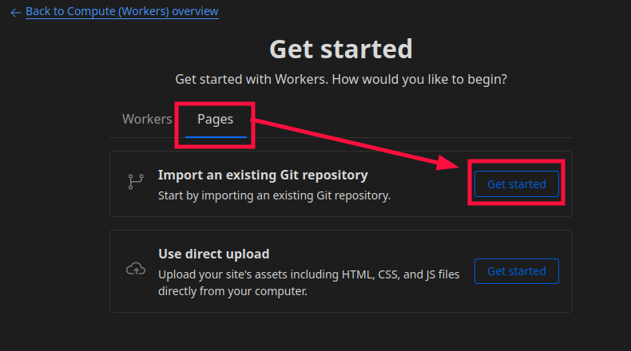

{: .reminder}
> If you've done this before, you'll have to select "*Add account*", then scroll down and select the new repo from the dropdown for the it to appear in Cloudflare.
> 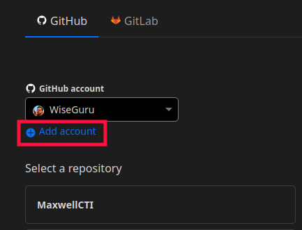
> 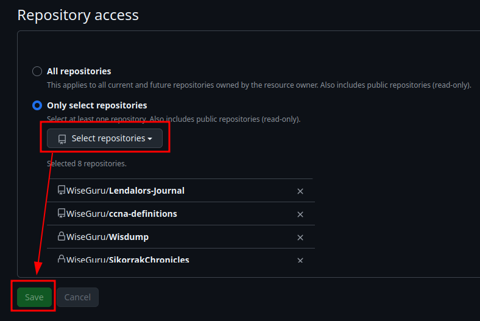

#### Configure your First Deployment
1. Enter the project name (default is the Repo name)
2. Set production branch to *Main*
3. Leave the *Framework* preset as default or set to *Eleventy*
	1. I don't think this matters, as we immediately change the commands afterward
4. Set the *Build command* to `npm run build`
5. Set the *Build output directory* to `dist`
 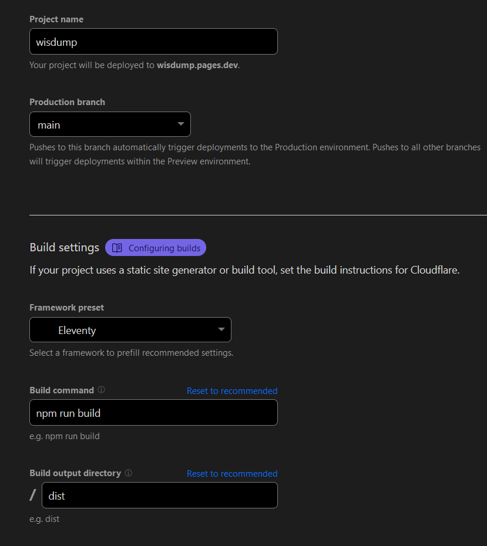

Then click Finish (or something, I completely forgot to screencap this part), and it will do the first build for your site! If you're going to run into problems, you're likely to run into them here. Check out the [Troubleshooting-Digital-Gardens](../BugsAndFixes/Troubleshooting-Digital-Gardens.md) guide at the very end for help.

{: .reminder}
> You may need to re-apply the features or appearance customizations you set earlier by clicking "Apply Settings" in the plugin.
### 04. (OPT) Register and Assign a Custom Domain
In order to configure various Cloudflare security features (*but not custom headers*), you will need to register a domain name and link it to your Pages project on Cloudflare.

In my opinion, the security features offered by *Cloudflare* are a big reason I picked it as a host over other services, so I don't really think this is an optional step. Also, for how cheap you can get a domain ($10 for a year), it's not even that expensive.

#### Transfer the Nameservers or Register a New Domain
It's easiest if you register the domain through Cloudflare, but not a requirement.
##### Registering a domain
1. Expand *Domain Registration* in the slide-out menu on the left, and choose *Register Domain*
2. Search for the domain you want to buy and purchase it.
	1. **NOTE**: Some of the more obscure *TLDs* (aka *Top Level Domains*, like .work or .online) are cheaper than .com or .io. If you don't care too much about branding, you could save a few bucks.
3. Back under your application, select the *Custom domains* tab, and click "*Setup a custom domain*"
4. Follow the steps, and you should be golden.

##### Transfer a domain or set Cloudflare nameservers
If you already own a domain with a different registrar, you can either change the domain's *Name Servers* to Cloudflare's, or you can *transfer the domain* (which I won't get into right now, and is different from *DNS Transfer*). The steps are very similar to the one's above; however, begin by navigating to your *Cloudflare Pages* app and click *Custom domains*.
1. Enter the domain you want to use, and then click *Begin DNS transfer*
2. Re-enter the name you want to use, and select whichever tier plan you want to use
	1. **NOTE**: Free is perfectly acceptable.
3. Follow the steps on the page, and update your domain registrar's Nameserver entries to Cloudflare's servers
4. Once the Nameserver update has been completed, you can add the domain as a *Custom domain* for your *Digital Garden*. 

#### Add Cloudflare Security and Optimization Features
Now that we've connected our domain to Cloudflare, we can view it under *Websites* at the top of the left-side slideout menu, and make a host of performance and security upgrades. From [your Cloudflare dashboard](https://dash.cloudflare.com), you should be able to see the domain you just registered, and a little green checkmark with *Active* next to it.

> Cloudflare is always adapting to new threats and frequently changes features and options. Use this section as more of a rough guide than hard-and-fast rules.

Click on your domain, and let's get started with the Quick Start Guide from the main panel.
1. Click "*Review Settings*" in the *Quick Start Guide* pane
	1. 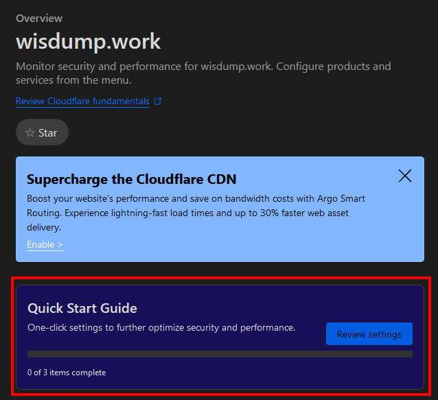
2. Enable *Automatic HTTPS rewrites*
3. Enable *Always Use HTTPS*
4. Your choice whether to *enable* or *disable* *Brotli* compression; I couldn't find anything indicating it was insecure to use, and is apparently a [A Fast Alternative to GZIP Compression](https://kinsta.com/blog/brotli-compression/)

Once done, we should go down the options in left slide-out menu and enable a bunch of other security and optimization features.

{: .tip}
>*Don't send email from your domain*? Stop anyone from impersonating you with **these rules that reject all email sent from your domain**:
> SPF: `TXT   @   "v=spf1 -all"`
> DMARC: `TXT  _dmarc.example.com   "v=DMARC1; p=reject"`
> 
> For more details, check out [Securing Email - MaxwellCTI](https://maxwellcti.com/technical-guides/securing-email/)


1. **DNS**
	1. Records
		1. If you don't use email with this domain, create two records to prevent anyone from sending mail from your domain.^[For more details, check out [Protecting your Identity and your Domain with Email Security](Protecting%20your%20Identity%20and%20your%20Domain%20with%20Email%20Security).]
			1. [SPF](https://maxwellcti.com/definitions-and-topics/spf): `TXT   @   "v=spf1 -all"`
				1. Type is `TXT`, the name is `@` (meaning your domain), and the value requires the quotes.
				2. This says that there are no servers authenticated to send email for your domain.
			2. [DMARC](https://maxwellcti.com/definitions-and-topics/dmarc/): `TXT   _dmarc   "v=DMARC1; p=reject"`
				1. The `_dmarc` indicates that it's a DMARC record.
				2. This says that all mail which fails to authenticate should be rejected.
			3. If you do use email, and for more details, check out [Securing Email - MaxwellCTI](https://maxwellcti.com/technical-guides/securing-email/)
	2. Settings
		1. *Enable DNSSEC*
			1. In short, [DNSSEC (link to Cloudflare docs)](https://www.cloudflare.com/dns/dnssec/how-dnssec-works/) effectively protects your *domain* from getting hijacked in an on-path attack.
2. **SSL/TLS**
	1. *SSL/TLS* is used to encrypt traffic between servers and clients, ensuring the data is authentic and confidential.
	2. Under "*Overview*", select "*Full (Strict)*"
		1. If you're squeamish, choose "*Full*"
		2. Because the whole site is hosted on Cloudflare, you shouldn't have to create any additional certificates
	3. Under "*Edge Certificates*"
		1. Enable "*HTTP Strict Transport Security (HSTS)*";^[[HSTS Preload List Submission](https://hstspreload.org)]^[[The HTTPS-Only Standard - HTTP Strict Transport Security](https://https.cio.gov/hsts/)] this brings up a big scary menu. Check the box and click *Next*, and choose the options in the following menu:
			1. Enable HSTS
			2. Max Age - 1 Year
				1. Required for *Preload*
			3. Enable Apply HSTS Policy to Subdomains
			4. Enable Preload
			5. Enable No-Sniff Header
				1. This prevents us from having to add it manually later on
		2. Set "*Minimum TLS Version*" to *TLS 1.3* (or minimum *TLS 1.2*)
			1. The default *TLS 1.0 and 1.1* are **busted**, with *TLS 1.1* being deprecated in 2021.
			2. *TLS 1.2* is less secure and slower than *1.3*, but you may have a use-case for needing it (but that's unlikely).
3. **Security**
	1. **NOTE**: This whole section has recently gone through a refresh, so I would advise exploring and experimenting more than following exactly what I say.
	2. The *Security* section is mostly about how your site handles *suspicious clients*. 
	3. Security level: *Low* or *Medium*
		1. Choose what level of visitors should receive a *Challenge* (like a CAPTCHA or similar) if they are deemed sufficiently threatening
		2. Default is *Essentially Off*, and going from *Low* to *High* increases the likelihood of suspicious visitors getting prompted for a Captcha
		3. I would advocate *Medium* and doing some testing from different browsers, using a VPN, etc., and downgrading if you feel it's necessary
	4. Challenge Passage: *Your preference* (Default 30 minutes)
		1. If a suspicious visitor gets past the challenge, this dictates how frequently they are re-challenged
		2. *Default* is *30* *minutes*, and based on your testing for Security Level (e.g., if it trips when you're using a VPN), I would set the time period higher^[[Life of a Tor user : r/TOR](https://www.reddit.com/r/TOR/comments/187rfbh/life_of_a_tor_user/)]
	5. Bot traffic
		1. Block AI Bots - Enabled
		2. AI Labyrinth (Beta) - Enabled
4. **Speed**
	1. This largely deals with *helping clients connect faster*. Some of these features are locked behind a *Pro* subscription or higher. Enable or disable options here as you feel comfortable.
	2. In my experience, "Rocket Loader" has caused problems with loading Mermaid charts, so I do not advise enabling it.


### 05. (OPT) Configure Dependabot on GitHub and Create Custom Headers
Now that we have *Cloudflare* configured securely, let's make sure we're not publishing obsolete and vulnerable code.

{: .warning}
> Deploying patches outside of **Digital Garden** updates *may* break your site. This has not happened to me yet, but if it happens *to you*, you can [revert Dependabot branch merges](https://docs.github.com/en/pull-requests/collaborating-with-pull-requests/incorporating-changes-from-a-pull-request/reverting-a-pull-request) and easily roll-back the problem.

Additionally, **I strongly recommended** that you familiarize yourself with *Visual Studio Code*, *Node.js*, and *GitHub Desktop*[^4]. But rather than make this already long guide longer, you can find more information on this under [How to manually update packages for Digital Gardens](How%20to%20manually%20update%20packages%20for%20Digital%20Gardens).

Ok, with that out of the way, let's...
#### Configure Security and Dependency Updates in GitHub

{: .reminder}
>If you apply updates through Dependabot, *Digital Garden* updates overwrite them, and you may be required to re-apply them. However, *it's better to be running patched* than unpatched, and *it's not that hard to do*.

In the Repo, navigate to "*Settings*," *Code security and analysis*, and enable Dependabot *Alerts* and *Security Updates*
	

When there is a dependency update or security issue, Dependabot will create a *pull request*, and Cloudflare will test the build in a preview to make sure it builds correctly.
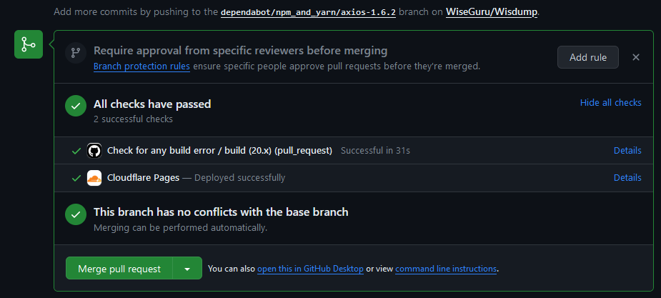

*Be wary of any pull requests where either the build fails or has a low compatibility rating.*
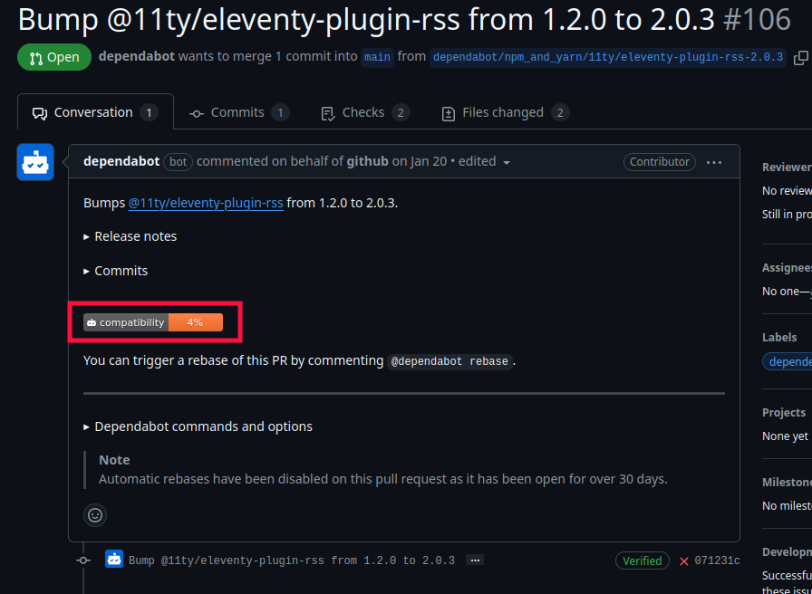
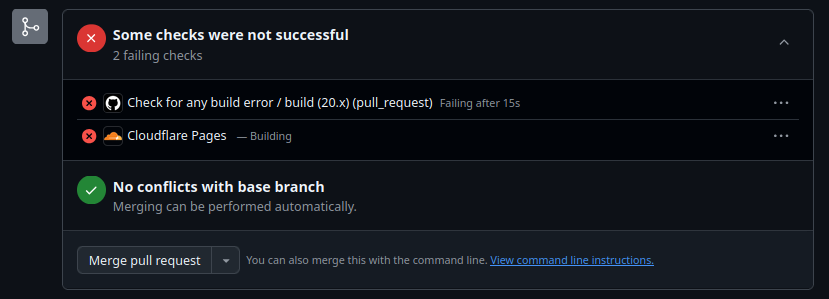

To merge a succeeding pull request, click the *green button to "Merge pull request* and then click *confirm merge*.


And it's updated! Hoo-raaay! But if you haven't already, I *highly recommend* you check out my guide on [How to manually update packages for Digital Gardens](How%20to%20manually%20update%20packages%20for%20Digital%20Gardens). It covers instances where Dependabot finds a security vulnerability but can't fix it for you automatically. 

#### Custom Security Headers
Cloudflare allows you to install custom headers^[[Headers · Cloudflare Pages docs](https://developers.cloudflare.com/pages/platform/headers/)] on your site without much fuss.

Installing security headers **critical**, as it improves your site's security and reduces the likelihood an attacker will use your site to hack your visitors. *Don't enable attackers*.

Don't believe me? You can check your site's headers and see how an attacker can take advantage of your sit with [securityheaders.com](https://securityheaders.com)

{: .reminder}
> These headers will get overwritten when *Digital Garden* releases an update, so you will have to re-apply them each time. This re-application is made much easier if you use **Github Desktop** and **Visual Studio Code** as mentioned before.

To add security headers, you need to first create a file called `_headers` in the folder `/src/site` in your GitHub Repo, then modify the *.eleventy.js* configuration file to the file through to Cloudflare.

The quickest way to create the file is to navigate to the folder in GitHub, and select *Add file* from the top right.


Name the file `_headers`,[^5] and insert the following text:

```
/*
  X-Frame-Options: SAMEORIGIN
  Permissions-Policy: document-domain=(self)
```

I've tested this against all of my sites and it hasn't caused any issues so far.

Next, you will need to modify the `.eleventy.js` file at the root of the repo to add a passthrough for the `_headers` file. This is also easy to do in GitHub.

Open the file `.eleventy.js` at the top-level folder of your repo by clicking on its name, and at the top-right corner of the code, click the drop-down menu next to the pen and select *Edit in place*.


Now, scroll down until you find all the lines that begin with `eleventyConfig.addPassthroughCopy`
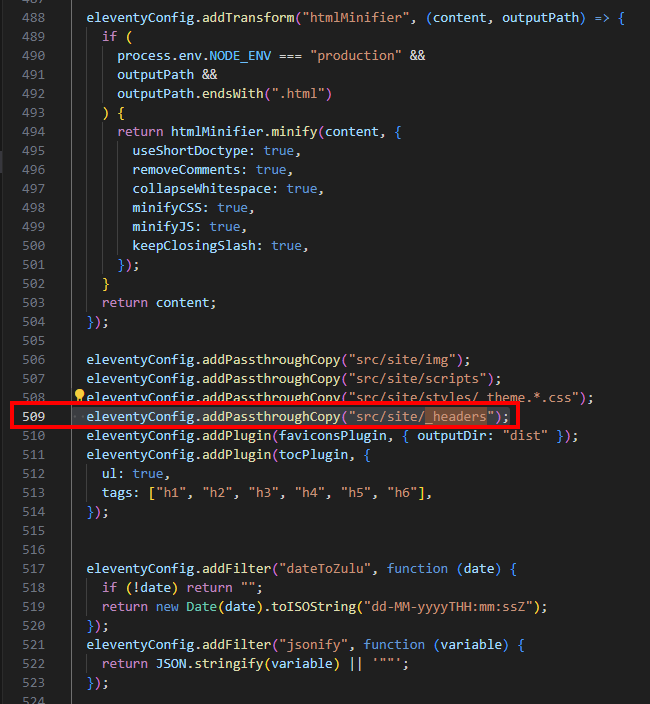

For me, it's around line 500-510.

Then, copy and paste the line below and insert it in the stack. It doesn't matter exactly where, just that it's among the other *Passthrough* statements.

```
eleventyConfig.addPassthroughCopy("src/site/_headers");
```

To verify that your headers have been added, under "*Deployment Details*" click on the *Headers* tab and see what was added

>Successful addition of headers:
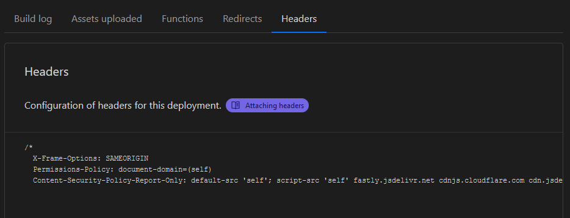

>Failed addition of headers:
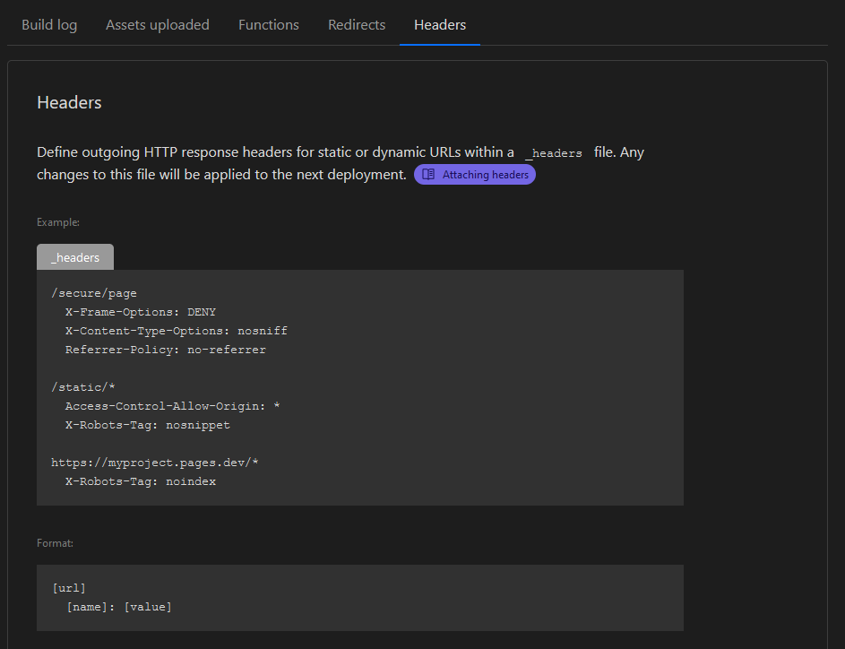

You can also go to [Security Header Scanner by Probely](https://securityheaders.com) to view your site's current headers after the deployment succeeds.[^6]

And that's it! Finally! Now go write some stuff and publish it.

## Troubleshooting
... unless it didn't work. 

Don't panic! If you're running into trouble, I highly recommend checking out my guide on [Troubleshooting-Digital-Gardens](../BugsAndFixes/Troubleshooting-Digital-Gardens.md), which covers common problems and the best way to find help.

## Other Resources and Honorable Mentions

The guide I used to get started is [How I Published My Knowledge Base Online for Free](https://sharaf.cc/40-49-toolbox/40-note-taking/40-01-obsidian/guides/publish-obsidian-vault-for-free/) by Sharaf; unfortunately, it gets a critical part of the process wrong during initial setup in the **Build Configuration**. Specifically, you need to set the "*Build command*" to `npm run build` and the "*Build output directory*" to `/dist`.


[^1]: [JavaScript Date toISOString() Method](https://www.w3schools.com/jsref/jsref_toisostring.asp)

[^2]: [luxon/docs/formatting.md at master · moment/luxon · GitHub](https://github.com/moment/luxon/blob/master/docs/formatting.md#table-of-tokens)

[^3]: Though it could also just be left as a space.

[^4]: What, you thought you were signing up for some free and easy way to upload your notes to the internet? Well with great power comes great security risks, and if you don't want some script kiddie owning your base, you should assume the people making free tools have overlooked something. Sometimes you gotta fix dependencies yourself for security updates, and boy howdy, knowing how these tools work is key.

[^5]: JUST `_headers`, not `_headers.txt`, not `headers`, and for godsake not `TheseAreMySecurityHeadersForMyCloudflareSite.txt.xml.zip.tar.gz`

[^6]: You might be wondering about the Content-Security-Policy warning; I don't want to distract from this guide, but here's why I gave up trying to implement [CSP on Digital Gardens](CSP%20on%20Digital%20Gardens)
