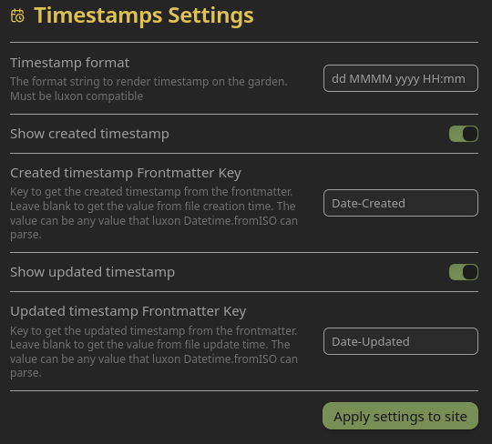
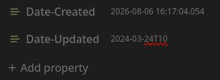

# Common Problems
{: .no_toc}

Below are common user-centered or -related problems. 

{: .tip}
> The problems described in this document should probably be converted into their own documents for better tracking.

## Table of Contents
{: .no_toc .text-delta}
1. TOC
{:toc}


# Common Problems

## Filetree disappears or collapses when you click a folder
This happens because a folder name has an illegal character in it, most likely an apostrophe. The offending folder will likely also be fully expanded.

Remove any special characters from folder names, republish the site, and work forward from there.

## You see a bunch of Failed deployments in Cloudflare to "Filetree"

This probably only happened if you included the branches from the template

 Set the *Main* branch as "Default" in GitHub

## First time publishing Garden stuck on "Calculating publication status from GitHub"
This is caused by the fine-tuned GitHub Token not being configured with the correct permissions. Your fine-grained personal access token should have the following permissions on the management page:


You can follow our guide here, [Creating Fine-Grained Tokens](../deployment-guides/fine-grained-tokens.md), to recreate your token with the correct permissions.

## Obsidian Properties Passthrough and Nunjucks Scripts
Scenario: You are trying display multiple Aliases (or other Obsidian Properties) on your notes. You've followed [Ole's guide on adding custom components](https://dg-docs.ole.dev/advanced/adding-custom-components/), and you've copied [uroybd's 001-aliases.njk](https://github.com/uroybd/topobon/blob/main/src/site/_includes/components/user/notes/header/001-aliases.njk) script into your repo in the right place, but nothing happens. This is because *Digital Garden does not inherently pass through all frontmatter* on a page; so the script you've copied has nothing to work with.

There are two possible solutions, but be careful; if your Nunjucks script is busted, your site won't deploy properly.

1. Enable the Digital Garden feature "*Let all frontmatter through*"
	1. This is mostly listed as a warning; enabling this without fully understanding the implication will likely break your site.  
2. You need to add the property `dg-pass-frontmatter` to each file you want the script to work on
	1. Other properties (like aliases) will be passed through to the Repo, and the `njk` script will be able to work with them.

## Build failure with htmlMinifier and HTML content in logs
When you try to publish your page, you get an error that looks like this: 


This is caused by `htmlMinifier` interpreting a character on your page incorrectly and failing to render the page properly.

From my testing, the `<` character in titles, headers, and some code blocks (like Mermaid with bi-directional arrows `<-->`) cause problems, but it may cause problems elsewhere too. Using the entity name (e.g., instead of `<3`, doing `&lt;3`) didn't solve the problem.

This is similar to the disappearing filetree issue, as it's the special characters `'` and `"` in titles that cause it not to render properly.

|Character|Entity Name|Entity Code|
|---|---|---|
|`<`|`&lt;`|`<`|
|`>`|`&gt;`|`>`|
|`&`|`&amp;`|`&`|
|`"`|`&quot;`|`"`|
|`'`|`&apos;`|`'`|

The only solution so far is to either disable `htmlMinifier` in the `.eleventy.js` file in your Digital Garden repo or remove the offending character.

{: .warning-title} 
> *WARNING*: Out-of-Band Patch
> 
> Commenting out htmlMinifier from .eleventy.js modifies template-managed code, and *will be overwritten* when the plugin updates.

To remove htmlMinifier, open `.eleventy.js` in your favorite text or code editor, and add a `//` to the beginning of every line in the "htmlMinifier" section.


Since I'm using [Kate](https://kate-editor.org/), I can drop the cursor at the beginning of the top line, press and hold **Ctrl + Alt**, and then use the arrow keys to drop the cursor to all subsequent lines. Save your changes then push the repo up.

## Created or Updated Date and Time not Appearing
You've set a manual date and time for each page you want to publish, but they are not showing up.

Most likely, you do not have the correct timestamp value in your file's frontmatter. When setting your own values, you create a frontmatter key (which can be anything you choose), but you *must* set the time values in the files using the ISO-8601 standard.

The standard is `YYYY-MM-DDTHH:mm:ss.sssZ`,[^1] [^2] where `T` marks the difference between date and time (though it could also just be left as a space).

For example, if you added the following creation date `2025-05-28 23:59:58.024` to a file and you set the timestamp format in your plugin settings as `HH:mm, MMMM dd yyyy`, your page would show "23:59, May 28 2025" below the header.

You only need data up to the most granular time you want. If you wanted to only show the date, you would just `YYYY-MM-DD`, or the to minute, just `YYYY-MM-DD HH:mm`


> Timestamp Settings in the Digital Garden plugin


> Frontmatter values formatted in ISO-8601


> Published page showing the created date and times.


## Missing Menu and Search Icons
When the sidebar is hidden, the hamburger menu icon at the top left and the magnifying glass in the search bar in the top right are missing, as seen in the example below.


This is caused by a bug in Digital Garden where the lucide icon library isn't loaded before it's called to generate the icons. This can be fixed by updating the script in `src/site/_includes/components/lucide.njk` to the following:

{: .warning-title} 
> *WARNING*: Out-of-Band Patch
> 
> This is a patch to template-managed code, and *will be overwritten* when the plugin updates.

<div class="code-example" markdown="1">
```html
<script defer src="https://unpkg.com/lucide@latest"></script>
<script defer>
  document.addEventListener('DOMContentLoaded', () => {
    lucide.createIcons({
      attrs: { class: ['svg-icon'] }
    });
  });
</script>
```
</div>

This updated coad loads the lucide icon library before the script calling the icons, and defers all of it until after the rest of the site has loaded (to ensure it doesn't prevent other components from loading). 


**References**
* Lucide UMD usage: [https://lucide.dev/guide/packages/lucide](https://lucide.dev/guide/packages/lucide)
* `defer` attribute on `<script>`: [https://developer.mozilla.org/docs/Web/HTML/Element/script#defer](https://developer.mozilla.org/docs/Web/HTML/Element/script#defer)
* `DOMContentLoaded` event: [https://developer.mozilla.org/docs/Web/API/Window/DOMContentLoaded\_event](https://developer.mozilla.org/docs/Web/API/Window/DOMContentLoaded_event)

### Pull request
- [Load lucide library before calling it by WiseGuru · Pull Request #320 · oleeskild/digitalgarden · GitHub](https://github.com/oleeskild/digitalgarden/pull/320)

## ITS Theme Callouts Not Formatting Correctly
The ITS theme allows the creation of right- or left-justified infobox callouts. These callouts should appear to the right or left of text, but sometines are not when published to Digital Gardens.


This is commonly caused by the theme settings not being synced with Digital Garden, which can be done in Obsidian by going to Settings>Community Plugins>Digital Garden>Appearance, and then applying theme settings at the top.


---

[^1]: [JavaScript Date toISOString() Method](https://www.w3schools.com/jsref/jsref_toisostring.asp)

[^2]: [luxon/docs/formatting.md at master · moment/luxon · GitHub](https://github.com/moment/luxon/blob/master/docs/formatting.md#table-of-tokens)
