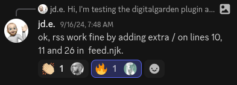
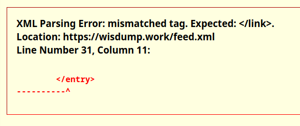
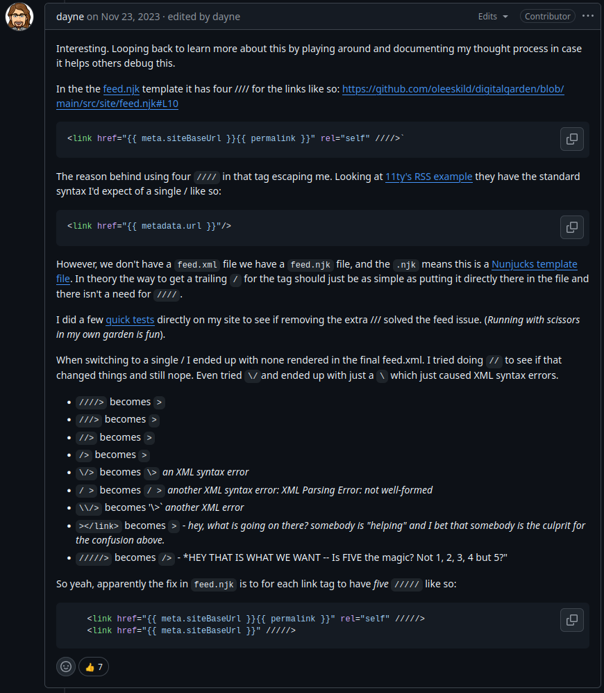

# Fixing the RSS Feed
## tl;dr
For most people, you can just open `/src/site/feed.njk` from your repo and modify lines 10, 11, and 26 to have 5 slashes (`/`) instead of 4.

Save and push changes, and your feed should start rendering properly.

**If you use custom icons**, you may only need the 4 slashes to make the feed work.[^1]

## Explanation

If you've tried to view the RSS feed for your site, you've probably seen the above error and noticed that your RSS feed otherwise looks well formed. If you look closely, the problem is when links are created with the feed.njk script, they don't get closed properly in the `feed.xml` output file.

I tried a few things before I remembered that I should search for answers first, and found that this problem is well documented and explored; in particular, dayne on GitHub did a ton of testing and found the solution of using 5 `/` instead of 4.[^2]

## Linked Issues and Pull Requests

### Pull Requests
[Fix XML Syntax of feed.xml by jeremi · Pull Request #280 · oleeskild/digitalgarden · GitHub](https://github.com/oleeskild/digitalgarden/pull/280)
### Issues
[RSS \</link\> missing · Issue #136 · oleeskild/digitalgarden](https://github.com/oleeskild/digitalgarden/issues/136#issuecomment-2340139055)
[\[BUG\] Fix for RSS feed/feed.xml error · Issue #311 · oleeskild/digitalgarden](https://github.com/oleeskild/digitalgarden/issues/311)
[Atom/RSS feed error · Issue #493 · oleeskild/obsidian-digital-garden](https://github.com/oleeskild/obsidian-digital-garden/issues/493)

----
[^1]: [RSS link missing · Issue #136 · oleeskild/digitalgarden](https://github.com/oleeskild/digitalgarden/issues/136#issuecomment-2340139055)]
[^2]: [Atom/RSS feed error · Issue #493 · oleeskild/obsidian-digital-garden](https://github.com/oleeskild/obsidian-digital-garden/issues/493#issuecomment-1825034758)
