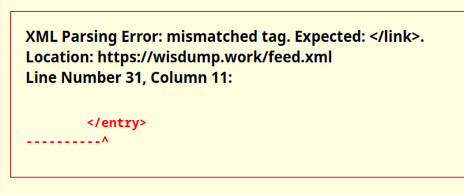
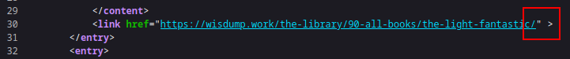
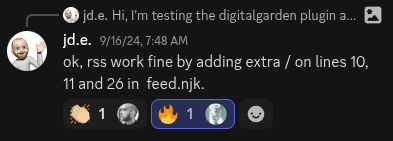
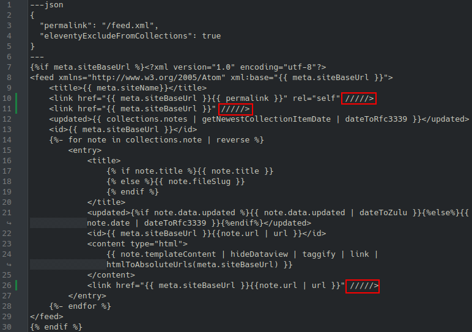
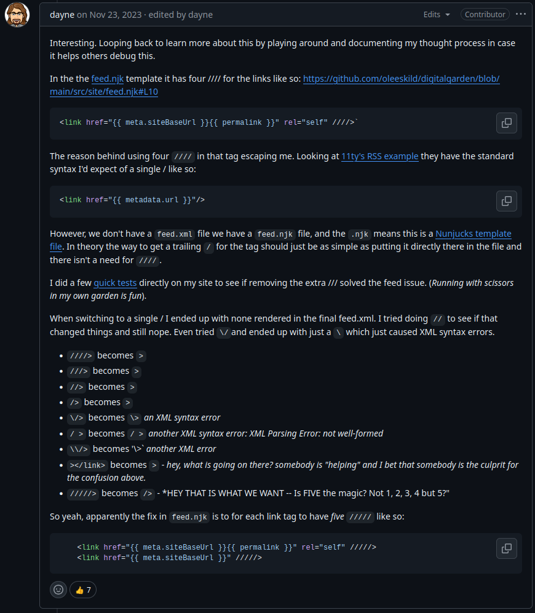

# RSS Feed Parsing Error
Out of the box, the RSS feed for Digital Gardens doesn't compile properly. When navigating to `yoursite.com/feed.xml`, you see an XML Parsing error (like below).

The raw XML file will reveal that the "link" tags are not being closed properly.

## How to Fix RSS Feed Parsing Errors

{: .warning}
> This is an out-of-band patch, and may be reverted when an update is applied. We recommend keeping a record of out-of-band patches to check and restore changes after an update.

To fix this, open `/src/site/feed.njk` from your repo and modify lines 10, 11, and 26 to have 5 slashes (`/`) instead of 4.

Save and push changes, and your feed should start rendering properly.

**If you add custom icons later**, you may only need the 4 slashes to make the feed work.[^1]

## Steps to Replicate and Investigation

dayne on GitHub did a ton of testing and found the solution of using 5 `/` instead of 4.[^2] 

In his second to last test, dayne tried `></link>`, and it resolved to `>`; Recent attempts to solve this problem tried removing the htmlMinifier from the application, and while this can solve other common problems,[^3] it did not change how `feed.njk` closed links.

Ole mentioned that this appears to be a problem with 11ty,[^4] and the bug re-appears occasionally.

## Linked Issues and Pull Requests
All bugs and fixes should be linked to existing Pull Requests or Issues with the template or the plugin.

### Pull Requests
[Fix XML Syntax of feed.xml by jeremi · Pull Request #280 · oleeskild/digitalgarden · GitHub](https://github.com/oleeskild/digitalgarden/pull/280)
### Issues
[RSS \</link\> missing · Issue #136 · oleeskild/digitalgarden](https://github.com/oleeskild/digitalgarden/issues/136#issuecomment-2340139055)
[\[BUG\] Fix for RSS feed/feed.xml error · Issue #311 · oleeskild/digitalgarden](https://github.com/oleeskild/digitalgarden/issues/311)
[Atom/RSS feed error · Issue #493 · oleeskild/obsidian-digital-garden](https://github.com/oleeskild/obsidian-digital-garden/issues/493)

----
[^1]: [RSS link missing · Issue #136 · oleeskild/digitalgarden](https://github.com/oleeskild/digitalgarden/issues/136#issuecomment-2340139055)]

[^2]: [Atom/RSS feed error · Issue #493 · oleeskild/obsidian-digital-garden](https://github.com/oleeskild/obsidian-digital-garden/issues/493#issuecomment-1825034758)

[^3]: See "Build failure with htmlMinifier and HTML content in logs" in [troubleshooting-digital-gardens](troubleshooting-digital-gardens.md)

[^4]: [RSS \</link\> missing · Issue #136 · oleeskild/digitalgarden](https://github.com/oleeskild/digitalgarden/issues/136#issuecomment-1521921175)
