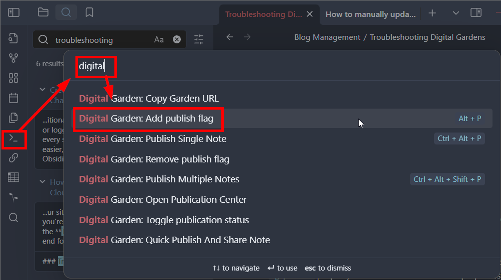
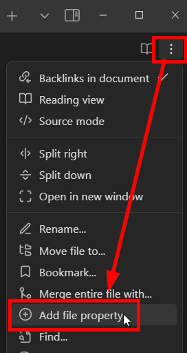
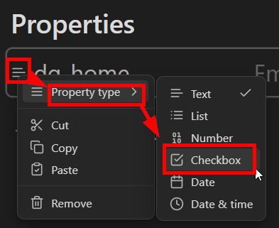
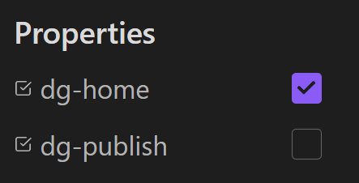
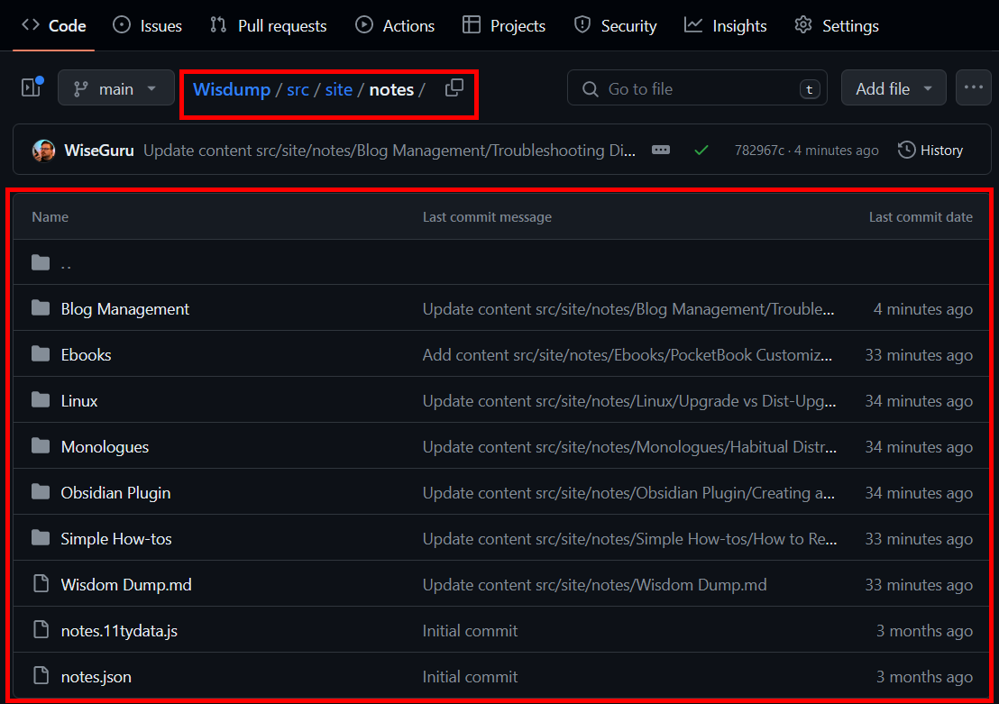
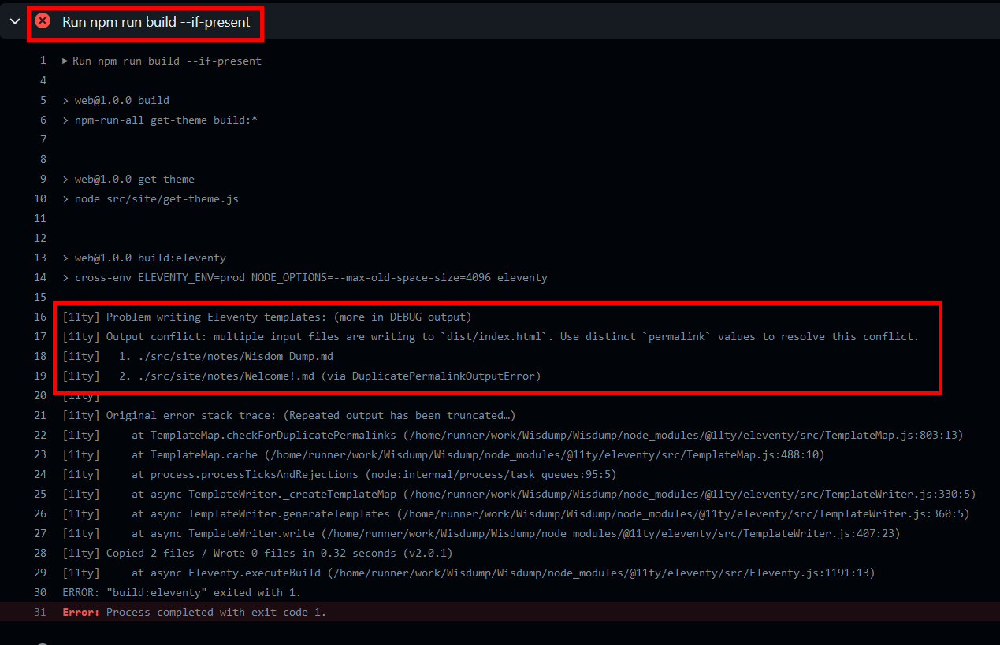

# Troubleshooting Digital Gardens
{: .no_toc}

Troubleshooting problems with your Digital Garden can be difficult, especially if you do not have a technical background. This guide aims to explain how the Digital Garden works, how to gather information, and the best way to ask for help.

## Table of Contents
{: .no_toc .text-delta}
1. TOC
{:toc}

{: .reminder}
> **Protect your Domain from Spoofing**
> Even if you don't have email connected to your domain, you should set up SPF and DMARC records for your Digital Garden. Check out [[../customization/prevent-domain-spoofing]] for more details.

# How to ask for Help
If you have gone through the steps below and you're still having trouble, then reach out on the [Digital Garden Discord **Help** Channel](https://discord.gg/Z46n2RNX8e) with the following information:
1. A link to your GitHub repo (if it's public)
2. A link to your site
3. Screenshots or copies of any logs you're seeing

This information makes it much easier to troubleshoot the problem and get you up and running!

# Initial steps - Digital Garden Isn't Deploying

> Below are steps you should take ***BEFORE*** asking for help. ***Following this guide*** will get your site up and running faster, and if you need help, ***will get you better help sooner***.

## 00. The Digital Garden Publication Pipeline
Let's review the publication pipeline for your Obsidian Digital Garden. Each stop is a place to look for typos, warnings, or problems.
1. Create content on Obsidian
	1. Set correct file properties
		1. *All* pages to be published *must* have `dg-publish` checked.
		2. Exactly **`one`** page must have `dg-home` checked.
	2. Plugins with special in-page code (e.g. Dataview) need to be formatted correctly.
	3. DG Plugin settings are managed in Obsidian>Settings>Digital Garden.
2. Publish content from Obsidian to Github
	1. Use the *Digital Garden Publication Center* to identify all pages being changed.
	2. Using shortcuts generates notifications at the top right and bottom right of Obsidian. 
3. GitHub performs a build and pushes content to your host (Vercel, Cloudflare, etc.)
	1. Logs are found under the *Actions* tab.
	2. Any changes made in the repo (e.g., custom headers and plugins, software package updates, etc.) can be reviewed and reverted.
4. Your host builds the site and publishes the content
	1. Cloudflare logs are found in Computer (Workers)>Workers & Pages>View Details.

## 01. Verify that your pages in Obsidian have the correct properties

**Only one** page should have the property `dg-home` checked, and it also *must* have the `dg-publish` property checked. You can add these properties a couple of ways:

### Option 1: Through the Obsidian Command Palette
{: .no_toc}

Open the Obsidian *Command Palette*, search for **Digital Garden**, and select the "Digital Garden: Add publish flag" command.


If you do not have a `dg-home` property set, you can manually change `dg-publish` to `dg-home` and then add another publish flag to the sheet.

### Option 2: Manually add the properties
{: .no_toc}

1. Select the three-dot menu at the top-left of your note, and click "Add file property..."
	1. 
2. Name the property either `dg-home` or `dg-publish`
	1. 
3. Select the icon to the left of the name, and change the "Property Type" to *Checkbox*
	1. 
4. Check the box to enable the property, uncheck the box to disable it.
	1. 
		1. With *this configuration*, the note is set as the home page, *but* will not be published to the Digital Garden, and *will result in a failed deployment.*
		2. Both `dg-home` and `dg-publish` need to be checked on the homepage.

> **Again**, go through your pages and make sure **only one page is set with** `dg-home`, and **every page you want published** is marked with `dg-publish`

**If you made any changes,** publish your *homepage* using the *Command Palette* or the *Digital Garden Publication Center* and check your site.

{: .note}
>Be careful when unchecking the `dg-publish` tag or moving many pages. Uploading multiple pages counts as one commit, but *deleting or moving multiple pages counts as one commit per page*. If you have a large site (100+ pages), you can quickly run out of available free commits.

If your site doesn't update, or your pages are marked correctly, proceed to the next step.
## 02. Check your GitHub Repo to make sure its populating
Log into your *GitHub* account, open your repository, and check `src/site/notes` to see if it's populated with any of your notes.



If it's not populated, it means GitHub is not receiving your notes, and this is likely caused by a **fine-grained token** misconfiguration, so let's just rebuild it from scratch.

{: .note}
>Even if you see a green checkmark in the Digital Garden plugin in Obsidian, that only checks if the token is *legitimate*, not that it has the correct permissions.

{: .warning}
>The tokens are only visible *immediately after creation or regeneration*, and if you do not copy/paste it before you navigate away from the page, you will have to regenerate it.
>This is not the end of the world, just a *douleurs dans le cul*, as Google Translate tells me the French say.

Here's [Ole's guide on creating a token from his site](https://dg-docs.ole.dev/advanced/fine-grained-access-token/), but let's go through each step below.
1. Go to [this page](https://github.com/settings/personal-access-tokens/new) to configure the token.
	1. You can also manually navigate there by selecting your Profile icon at the top right, then *Settings*, then *Developer Settings* at the bottom of the left column, expand *Personal access tokens*, and then select *Fine-grained tokens*, and click **Generate new token**
2. Enter the following information:
	1. Token name
		1. This is for your reference, and must be unique among *your* tokens
	2. Expiration date
		1. Default is 30 days, drop-down menu allows you to select up to 90, but you can manually configure up to 1 year
	3. Description
		1. Again, up to you
	4. Repository Access
		1. Click the radio button for "Only select repositories" and choose your Digital Garden repository
3. Expand *Repository permissions* and configure the following permissions
	1. Contents
		1. Read and write
	2. Pull Requests
		1. Read and write
	3. **NOTE**: "Metadata" will automatically change to "Read-only", and this is correct and good.
4. Click *Generate token*
	1. *Immediately* copy and paste this token into the Digital Garden plugin in Obsidian, *before* navigating away from the page.

Once the new token has been added, publish your *homepage* using the *Command Palette* or the *Digital Garden Publication Center* and check your site.

If your site doesn't update, but you are seeing your notes in GitHub, proceed to the next step.

## 03. Check the build and Gather Logs
Will add details later, but for now, check these three things:

1. You are publishing to the "Main" branch by default
	1. [Changing the default branch - GitHub Docs](https://docs.github.com/en/repositories/configuring-branches-and-merges-in-your-repository/managing-branches-in-your-repository/changing-the-default-branch)
	2. 
2. In GitHub, got to the *Actions* tab and look for Errors
	1. 
	2. 
	3. 
		1. If you see errors like this one, it means there are duplicate files in your repo or two pages marked with `dg-home`.
3. Host (Vercel, Cloudflare, etc.) logs
	1. These logs will look similar to the ones in GitHub.
	2. [Vercel](https://vercel.com/docs/deployments/logs)
	3. [Cloudflare Pages](https://developers.cloudflare.com/pages/functions/debugging-and-logging/#view-logs-in-the-cloudflare-dashboard)

### 11ty error troubleshooting
If you're getting an 11ty error during the build, you may have 2 or more files with `dg-home` set to *true* or pages with duplicate names/links.

The first 5 or so lines of the 11ty output contain the information you want.

#### Sample Log; Duplicate Files
In this case, I have a problem with the file "Do I have ADHD?" which was originally uploaded from a Windows machine (which does not allow a `?` in the file name) and then a Linux machine, which has no problem with question marks in file names.

DG formatted their URLs the same way, and there was a build error.


Depending on the issue, you may need to manually delete the file from your GitHub Repo or Obsidian. If the issue is a syntax problem (like above) and you did a "Publish All" command, then the problem should resolve itself when it deletes the (now missing) file and rebuilds the site.

#### Sample Log; Multiple Homepages
As an example, I set two pages to have the `dg-home` page checked; it references `dist/index.html` in the second line, indicating two or more files writing to `dist/index.html`, which is the home page.


While the log tells you which files are being problematic (in this case, "S16 - We Got Milk" and "Fake Character"), you can also use a Dataview table to find and review all published files.

Create a Dataview codeblock and copy/paste the code below into it. This will generate a full list of all published pages with any page that has a configured `dg-home` home attribute at the top, and then is sorted by file name (which can help to identify duplicate files with slight name differences).

<div class="code-example" markdown="1">
```
TABLE dg-home, dg-publish
WHERE dg-home=true OR dg-publish=true
SORT dg-home DESCENDING, file.name
```
</div>
