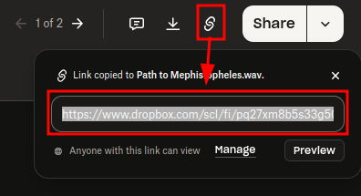
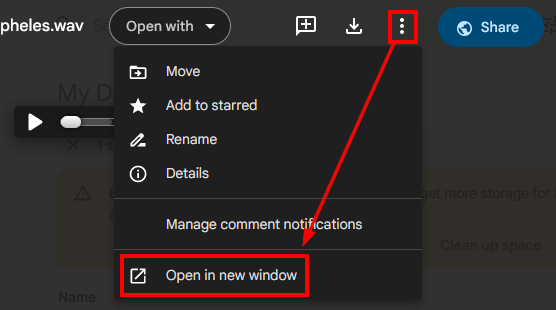
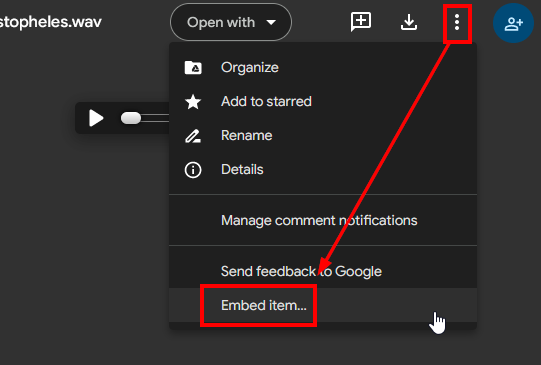
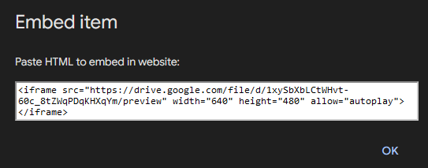

> **Reminder**: Free software isn't free. Support Ole, the Digital Garden developer: [Buy Ole Eskild Steensen a Coffee - oleeskild - Ko-fi](https://ko-fi.com/oleeskild)

There are two ways to embed media in your site; you can use an iFrame, or (if it's audio), you can use the HTML `<audio>` element.

> Note the the ellipses are just there for slight obfuscation.^[I know, there are ways you can strip the file URL from my other site, but this is just to make it a little more difficult.]

```HTML
<audio controls>
  <source src="https://www.dropbox.com/scl/fi/pq27...qkw/Path-to-Mephistopheles.wav?rlkey=bk84g42...mwvo&st=x9xo6i25&raw=1" type="audio/wav">
  Your browser does not support the audio element.
</audio>
```


```HTML
<iframe style="background: #2F383E;" src="https://drive.google.com/file/d/1xySbXbL...KHXqYm/preview" width="480">
</iframe>
```

# Adding Music from Dropbox using the HTML 'audio' element
Here's how you can embed music *which you have the rights to share* into your site with Dropbox. For this example, we're using a song whose lyrics I wrote and whose composition and performance I commissioned for a DnD game I play in as a bard; [The Path to Mephistopheles](https://lendalorsjournal.online/songs-and-stories/path-to-mephistopheles/).

## 1. Upload the file to Dropbox and set the permissions to be public.
- You need these open permissions so the un-credentialed site can access it.

## 2. Open the file and copy the link to share the file.


You will get a URL that looks something like this:

`https://www.dropbox.com/scl/fi/pq27xm8b5s33g508o7qkw/Path-to-Mephistopheles.wav?rlkey=bk8...vo&st=ryuj9e70&dl=0`
> Ellipses used for obfuscation.

## 3. Modify the link to allow direct access
At the end of the file, modify the end of the file so that instead of `&dl=0`, set it to `&raw=1`. This will allow your site visitors to listen to the song instead of automatically downloading it when they access your site.

`https://www.dropbox.com/scl/fi/pq27xm8b5s33g508o7qkw/Path-to-Mephistopheles.wav?rlkey=bk8...vo&st=ryuj9e70&raw=1`
> Ellipses used for obfuscation.

## 4. Embed the song with code
Don't use a codeblock for this; just write the code directly on the page.
- A codeblock will let you see the code, but won't actually run it.

Here's the code you'll use; let's break it down.
```HTML
<audio controls>
  <source src="https://www.dropbox.com/scl/fi/pq27...qkw/Path-to-Mephistopheles.wav?rlkey=bk84g42...mwvo&st=x9xo6i25&raw=1" type="audio/wav">
  Your browser does not support the audio element.
</audio>
```

1. You're using the [HTML `<audo>` element](https://www.w3schools.com/html/html5_audio.asp) to embed your media
	1. The source element uses `src` to set the URL source, and `type` to say what kind of file it is.
		1. Hence, an MP3 file would be `type=audio/mpeg`
	2. You can use multiple sources for the same file, and the browser will stream the first one it can use.
		1. This can be helpful if you want to ensure compatibility, while, say, optimizing quality
			1. Like if you had the audio in ALAC and wanted the world to hear it in its lossless glory, but wanted to make sure the peasants outside your pretty walled garden could hear even the tinny compressed version, and so then added a source for an MP3 version after.
2. The text `Your browser does not...` will only appear if none of the source files you link work.
3. There are other features you can enable, like autoplay, but that's super rude and you should be ashamed for even thinking of doing that.

You're done! Publish the page and listen to your success.


# OBSOLETE - Host with Google Drive
> The media I hosted on Google Drive recently started giving me problems, and I had to switch to Dropbox. I have no idea if this is a temporary thing or permanent, so I'm leaving this here in case it's helpful.


Wanna get the code automatically from Google Drive?
1. Open a preview of the file, click on the three-dot menu next to the **Share** button, and then click "*Open in new window*"
	1. 
2. In the new tab, click on the three-dot menu again, and click "**Embed**"
	1. 
3. You'll get something that looks like this:
	1. 
4. Just copy and paste that HTML into your Obsidian note, and boom! You got yourself an embed.
	1. You may get prompted to "Create embed"; **THIS IS LIES.** Instead of creating the embed, it creates a codeblock that's impenetrable. Click **Dismiss**
5. Customization
	1. I found that lowering the width to 480 and removing the height requirements made for a cleaner page preview.
	2. Disable **Autoplay** by removing that "allow" function, or condemn your soul to the foulest of hells.
	3. Forgetting quotes around values may or may not cause problems with Cloudflare.
