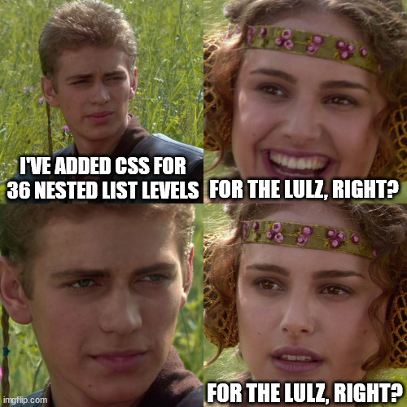

# Custom List Styles for Nested Ordered Lists
{: .no_toc}

By default, ordered and unordered lists use a single character set for all list levels. Obsidian plugins like [Lawlist: Custom List Styles](https://github.com/willem-schlieter/lawlist) allow you to set custom list orders, and the script below allows you to bring them into 

## Table of Contents
{: .no_toc .text-delta}
1. TOC
{:toc}


## How to add Custom List Styles

Per the instructions on [on Ole's Digital Garden Docs site](https://dg-docs.ole.dev/advanced/adding-custom-components/), you can add custom CSS script to the folder `src/site/styles/user`, or the file `src/site/styles/custom-styles.scss` (though this is considered deprecated).

The script below is written for the deprecated method. All you have to do is copy and paste the script below into the `custom-styles.scss` file.

You can further customize this using different list types[^1] or adding additional formatting[^2] using CSS.

Unfortunately, this formatting won't loop, and once you reach the lowest level it will just keep using the last style.[^3]

If you want to simulate looping, you can copy/paste the existing code and add the appropriate `ol/ul`'s to indicate the new levels.



### The Script
You may paste the script below inside or outside of the `body {}` brackets and it should work.

{: .success}
> You may need to flush your browser cache for the updated CSS to appear. When in doubt, open your site in a *Private* window (`Ctrl+Shift+N` for Chrome, `Ctrl+Shift+P` for Firefox), and close/reopen it between configuration tests.

<div class="code-example" markdown="1">
```CSS
/* Ordered Lists */
ol {
  list-style-type: decimal; /* Level 1: 1, 2, 3, ... */
}

ol ol {
  list-style-type: lower-alpha; /* Level 2: a, b, c, ... */
}

ol ol ol {
  list-style-type: lower-roman; /* Level 3: i, ii, iii, ... */
}

ol ol ol ol {
  list-style-type: upper-alpha; /* Level 4: A, B, C, ... */
}

ol ol ol ol ol {
  list-style-type: upper-roman; /* Level 5: I, II, III, ... */
}

ol ol ol ol ol ol {
  list-style-type: decimal-leading-zero; /* Level 6: 01, 02, 03, ... */
}

/* Unordered Lists */
ul {
  list-style-type: disc; /* Level 1: Bullet */
}

ul ul {
  list-style-type: circle; /* Level 2: Hollow Circle */
}

ul ul ul {
  list-style-type: square; /* Level 3: Square */
}

ul ul ul ul {
  list-style-type: disc; /* Level 4: Bullet */
}

ul ul ul ul ul {
  list-style-type: circle; /* Level 5: Hollow Circle */
}

ul ul ul ul ul ul {
  list-style-type: square; /* Level 6: Square */
}
```
</div>


---

[^1]: [CSS list-style-type property](https://www.w3schools.com/cssref/pr_list-style-type.php)

[^2]: [CSS Styling Lists](https://www.w3schools.com/CSS/css_list.asp)

[^3]: The Obsidian plugin [LawList by willem-schlieter](https://github.com/willem-schlieter/lawlist) loops, fancy fancy!
