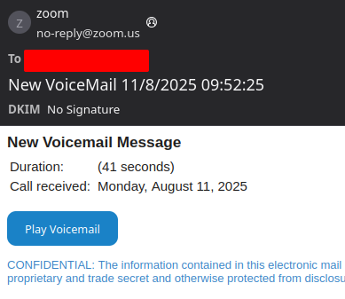

# Prevent Domain Spoofing
{: .no_toc}

It is incredibly easy to impersonate someone online. One of the easiest methods is called [spoofing](https://www.fortinet.com/resources/cyberglossary/email-spoofing), where an attacker sends an email that looks like it comes from you and your domain, but doesn't require any hacking or authentication.

Email is not a secure protocol; it doesn't require any kind of authentication or authorization before you can send or receive an email. This means that without anything else, I could send an email as jeff.bezos@amazon.com and the email protocol has nothing to verify that I'm not Jeff Bezos.

> An example spoofed email from [Zoom.us](https://www.zoom.us)

{: .success-title}
> Don't send email from your domain?
>
>Stop anyone from impersonating you by adding these rules to your DNS host:
> SPF: `TXT   @   "v=spf1 -all"`
> DMARC: `TXT  _dmarc.example.com   "v=DMARC1; p=reject"`

## Why are we doing this?

There are new(ish) tools and protocols that have been tacked onto email to make it more secure. Specifically, tools like [SPF, DKIM, and DMARC](https://maxwellcti.com/technical-guides/securing-email/) identify authorized email servers, authenticate emails, and set a policy for what to do when recipients get unauthorized email.

- **SPF** identifies which servers are allowed to send email.
- **DKIM** signs messages sent from configured servers.
- **DMARC** tells receiving servers what to do with inauthentic mail.

If you send and receive emails from your own email server, have a newsletter, or just want to learn more, we recommend checking out [this guide at MaxwellCTI on Securing Email](https://maxwellcti.com/technical-guides/securing-email/). This gets into the nitty-gritty and has a roll-out plan for organizations implementing email security.

## What if I don't send email from my domain?

For most people with a Digital Garden, you may not have email configured and just want to stop anyone else from sending email pretending to be you.

To do this, you only need two records added to your DNS host; **SPF** and **DMARC**. We do not need DKIM, because it can only be configured if you have a corresponding email server.

Go to your name server (this is either where you registered your domain, like [Namecheap](https://www.namecheap.com/support/knowledgebase/article.aspx/434/2237/how-do-i-set-up-host-records-for-a-domain/) or [Porkbun](https://kb.porkbun.com/article/68-how-to-edit-dns-records), or where your site is hosted, like [Vercel](https://vercel.com/docs/domains/managing-dns-records) or [Cloudflare](https://developers.cloudflare.com/dns/manage-dns-records/how-to/create-dns-records/)), find where the DNS records are managed, and create two new records.

{: .tip}
> The TTL (time to expiration) for these records can be anything, but while troubleshooting, we recommend choosing something short, like 5-30 minutes. Once done, you can extend the TTL to hours.

1. **SPF Record**
	1. Name: `@`
		1. This means it affects the root domain, like `wisdump.work`
	2. Type: `TXT`
		1. This is a "text" record
	3. Value: `v=spf1 -all`
		1. This says it's SPF version 1 (there is only one version), and to *Fail* `all` messages
		2. SPF is processed sequentially; if you want to add authorized email servers in the future, those servers would go in front, like `v=spf1 +include:mail.wisdump.work -all`
2. **DMARC Record**
	1. Name: `_dmarc`
		1. This signifies that it is a DMARC record
	2. Type: `TXT`
		1. This is a "text" record
	3. Value: `v=DMARC1; p=reject`
		1. This says it's DMARC version 1 (there is only one version) and sets the policy to `reject` any emails which fail authorization
		2. Since SPF fails all emails, this policy will instruct receiving servers to Reject any emails it receives from your domain.

Once done, you can use the [MxToolbox Supertool](https://mxtoolbox.com/SuperTool.aspx) or [dmarcian](https://dmarcian.com/) to verify that you've configured it correctly. It usually only takes about 30 minutes for the changes to take effect.

This effectively stops attackers in their tracks; they can't send emails impersonating you, and now have to take a few more steps to target you and people you know. Well done!