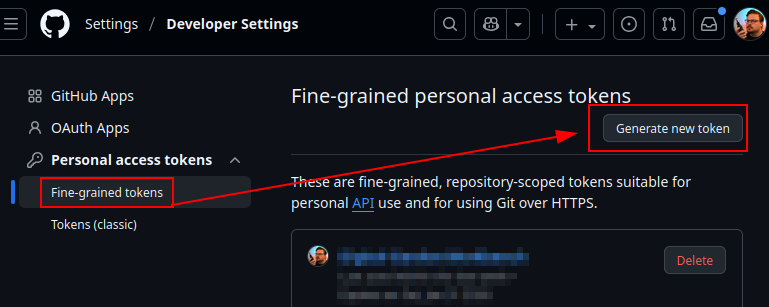
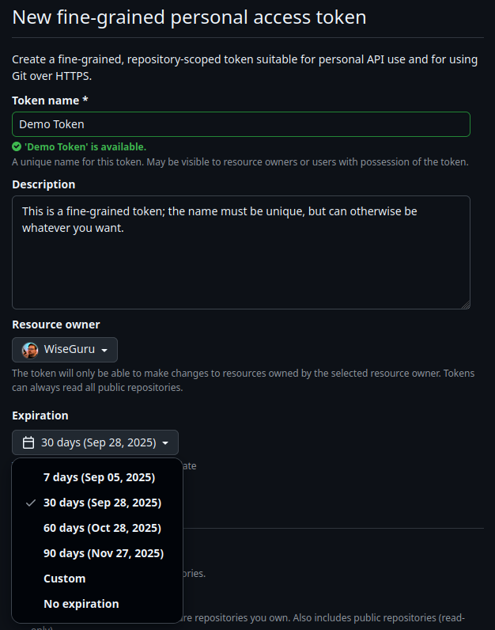
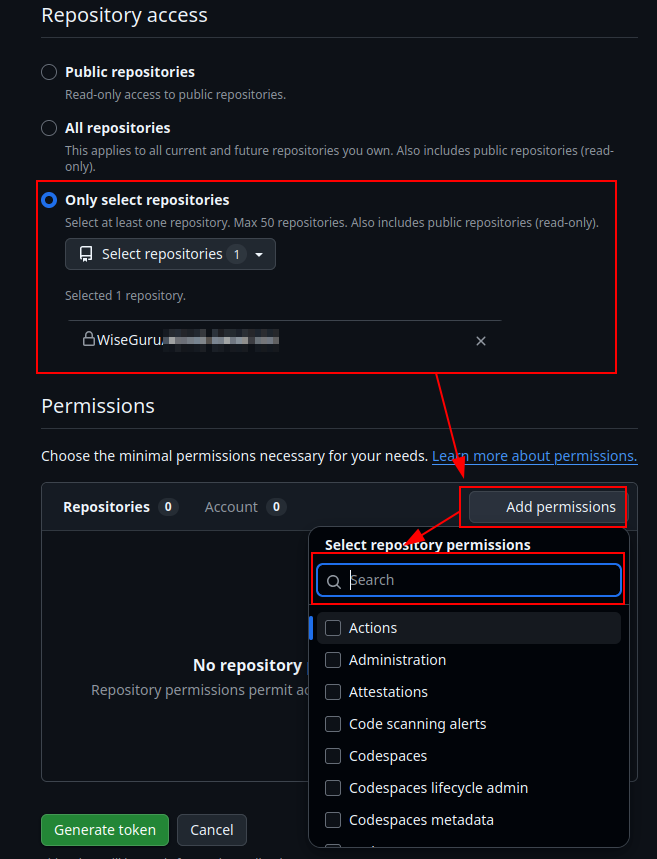
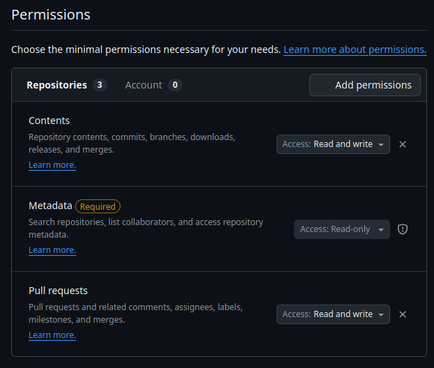
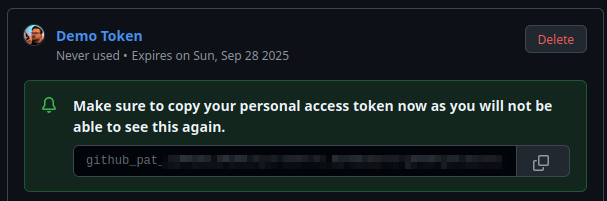
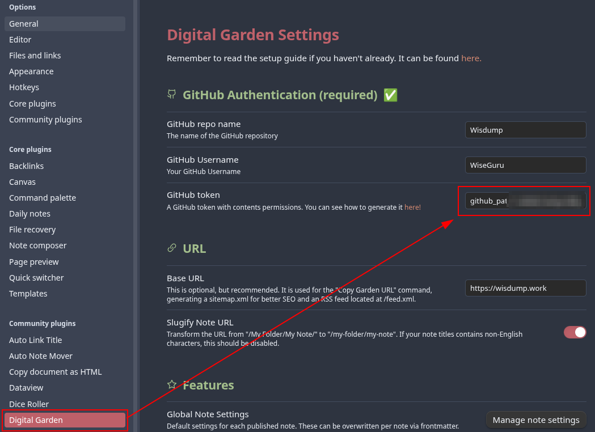
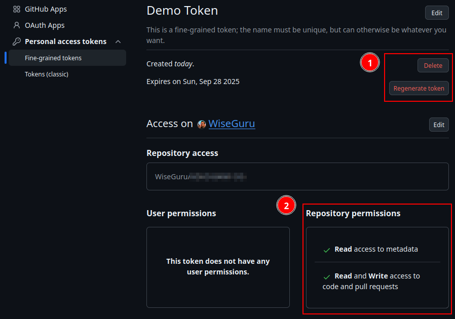
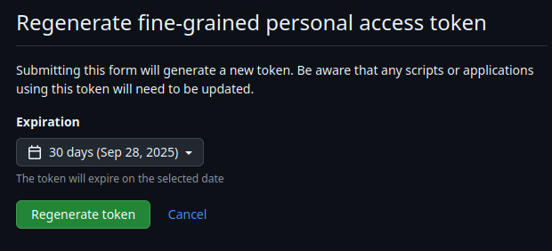
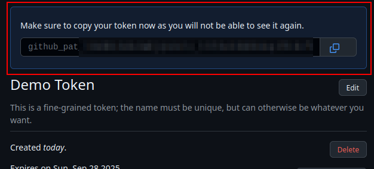

# Creating Fine-Grained tokens in GitHub
{: .no_toc}

In order to allow the Digital Garden plugin to connect to your Digital Garden repo, you need to create a fine-grained personal access token (PAT) with the correct permissions.

[Screenshot of topic]

## Table of Contents
{: .no_toc .text-delta}
1. TOC
{:toc}

## What are Fine-Grained Tokens
Fine-grained tokens a secure way for users to connect with GitHub via terminal or API.[^1] They can be limited in scope to only provide the necessary permissions and can be easily revoked, making them ideal single-purpose applications.

Digital Garden uses them to securely connect your Obsidian DG plugin with the repo you built from the Digital Garden template. Oleeskild also has a guide to create a [fine grained access token](https://dg-docs.ole.dev/advanced/fine-grained-access-token/).

## Creating a Fine-Grained Token
To get started, log into GitHub from the browser.

### Step 1. Navigate to "Developer Settings" and click "Generate a new token"
1. Select "*Settings*"
2. In the left bar, select "*Developer Settings*" at the very bottom
3. In the left bar, expand "*Personal access tokens*" and select "*Fine-grained tokens*"
4. Click "*Generate new token*"
	1. You may required to re-authenticate with your MFA token or GitHub app.

### Step 2. Configure the token
Make the following changes to each section

1. Main settings
	1. Token name
	2. Token expiration date
		1. Cannot go further than a year.
		2. Once a token expires, it will need to be regenerated.
		3. IIRC, you can just reactivate the token, but you may need to copy/paste the token back into the plugin.
2. Repository Access
	1. "*Only select repositories*" and select the repository
3. Repository Permissions
	1. *Contents*: Read and write
	2. *Metadata*: Read-only (this is set automatically)
	3. *Pull Requests*: Read and write

{: .warning}
> This is the only time you will see this token. You navigate away from the page, you will need to regenerate the token following steps at the bottom of this guide.

1. When you're ready, click on the green "Generate Token" button at the bottom of the screen.
2. *This is the only time on GitHub that you will be able to see this token!*
	1. Feel free to save it to your preferred password manager as a backup.
	2. It is also stored in the plugin itself in clear text.

### Step 3. Add the PAT to the Digital Garden Plugin
Copy and paste the token from GitHub into the Digital Garden plugin in Obsidian.

1. Open Obsidian, go to *Settings*, and in the left column under *Community Plugins* select *Digital Garden*. Enter the Repo name, your user account name, and paste the **Fine-Grained Token you just created**.

### Step 4. Managing and Regenerating the Token

From the Fine-grained tokens page, you can also review and manage the token by clicking it's name. 

This allows you to Delete or Regenerate the token and review its permissions. 

Regenerating the token allows you to set a new expiration date. The old token will expire, and the new token will have to saved/entered into the plugin to be able to continue publishing changes.

[^1]: [GitHub personal access tokens](https://graphite.dev/guides/github-personal-access-token)
