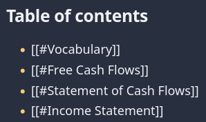
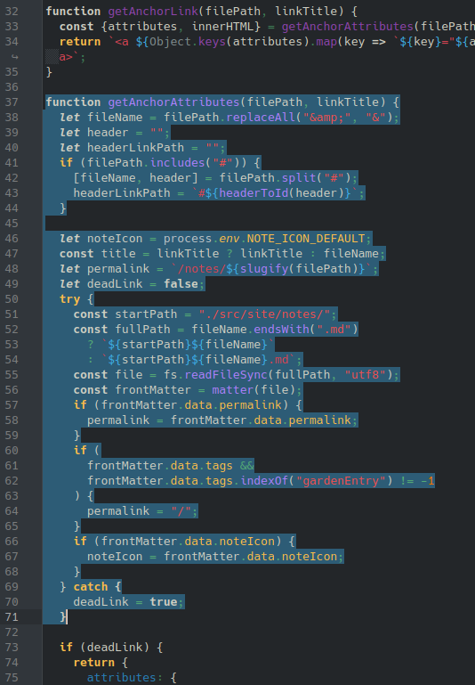
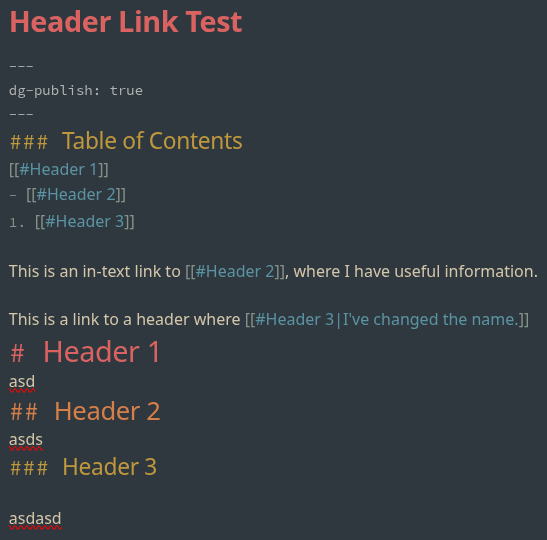
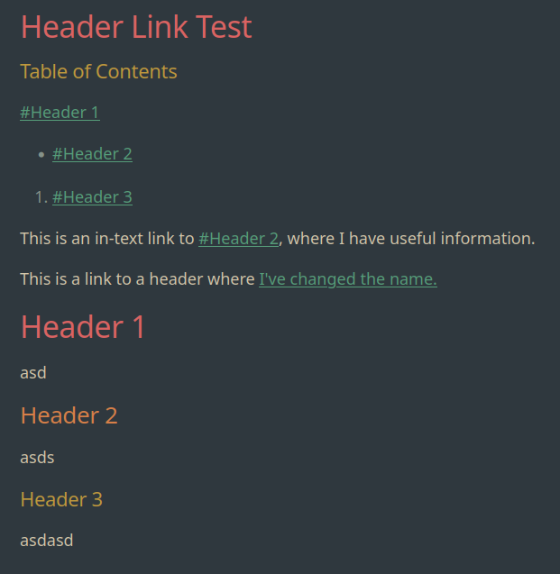

# Broken Header Links
{: .no_toc}

By default, header links (like `[[#header]]`) don't render in Digital Gardens. They're often used in DIY Table of Contents, and are much faster than typing out the whole file name every time you want to reference a specific header.

Fortunately, the fix is relatively simple, and there's already a Pull Request you can integrate into your own garden.

## Table of Contents
{: .no_toc .text-delta}
1. TOC
{:toc}

# How to Fix Broken Header Links
This repair comes from a pull request by [foxblock](https://github.com/foxblock) (who also incidentally has a template for using the [Digital Garden plugin with GitHub Pages](https://github.com/foxblock/digitalgarden_gh-pages)), and all credit goes to them. Their PR also includes changes to how code blocks interact with titles and fixing links with an `&` in the title. Below are just the steps to fix header links and and `&` because they are part of the same commit.

{: .warning}
> This is an out-of-band patch, and may be reverted when an update is applied. We recommend keeping a record of out-of-band patches to check and restore changes after an update.

## Step 1. Update `eleventy.js`

Replace the lines 37-71 in the `eleventy.js` (screenshotted above) at the root of your Digital Garden repo with the following code:



function getAnchorAttributes(filePath, linkTitle) {
  let fileName = filePath.replaceAll("&amp;", "&");
  let header = "";
  let headerLinkPath = "";
  if (fileName.includes("#")) {
    [fileName, header] = fileName.split("#");
    headerLinkPath = `#${headerToId(header)}`;
  }

  let noteIcon = process.env.NOTE_ICON_DEFAULT;
  const title = linkTitle ? linkTitle : filePath;
  let permalink = "";
  let deadLink = false;
  // if fileName is empty we are only jumping to heading in this file
  // NOTE: will not load the correct noteIcon in that case, since we don't have access to the filename
  if (fileName.length > 0) 
  {
    try {
      permalink = `/notes/${slugify(fileName)}`;
      const startPath = "./src/site/notes/";
      const fullPath = fileName.endsWith(".md")
        ? `${startPath}${fileName}`
        : `${startPath}${fileName}.md`;
      const file = fs.readFileSync(fullPath, "utf8");
      const frontMatter = matter(file);
      if (frontMatter.data.permalink) {
        permalink = frontMatter.data.permalink;
      }
      const isGardenHome = frontMatter.data.tags && frontMatter.data.tags.indexOf("gardenEntry") != -1;
      if (isGardenHome) {
        permalink = "/";
      }
      if (frontMatter.data.noteIcon) {
        noteIcon = frontMatter.data.noteIcon;
      }
    } catch (error) {
      // NOTE (JS, 28.05.25): This will generate a few false-positives for any
      // text looking like a link inside a code-block. The link will not actually be generated though.
      // the link filter is called 2x by 11ty: once with just the raw text (no markdown) and once converted to html 
      // (the first parse generates the false-positive message, but does not seem to matter)
      console.log(`DeadLink detection! filePath: ${filePath}, linkTitle: ${linkTitle}, error: ${error.message}`);
      deadLink = true;
    }
  }



## Step 2. Formatting and Results

The final result isn't perfect IMO, since it includes a `#` before the header. Maybe that's intentional and is a good reference for people that it's a link to a header and not to another page. In either case, you can change the name of the link with markdown to cover it up. 

Below is a screenshot of the source page in Obsidian, along with the resulting rendered website. 

## Linked Issues and Pull Requests
All bugs and fixes should be linked to existing Pull Requests or Issues with the template or the plugin.

### Pull Requests

- [Fix edge cases in link creation by foxblock · Pull Request #321 · oleeskild/digitalgarden · GitHub](https://github.com/oleeskild/digitalgarden/pull/321)
### Issues

- [(BUG) Links to headings in the same document are not created · Issue #318 · oleeskild/digitalgarden](https://github.com/oleeskild/digitalgarden/issues/318)
---