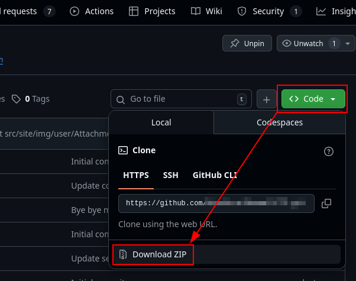
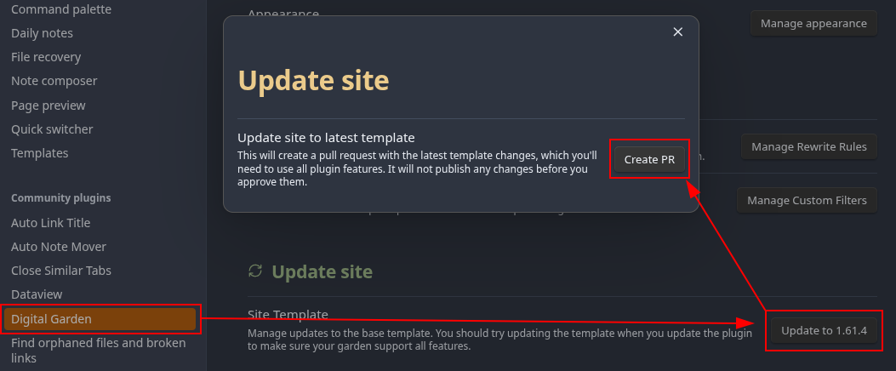
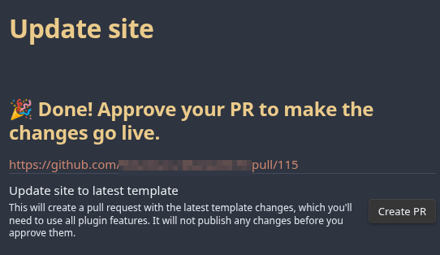
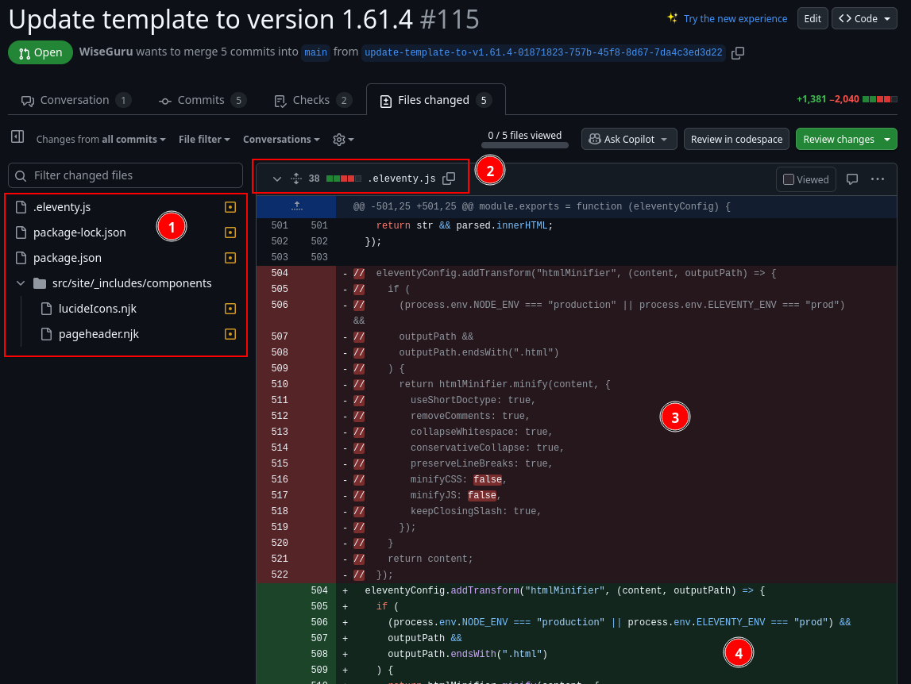
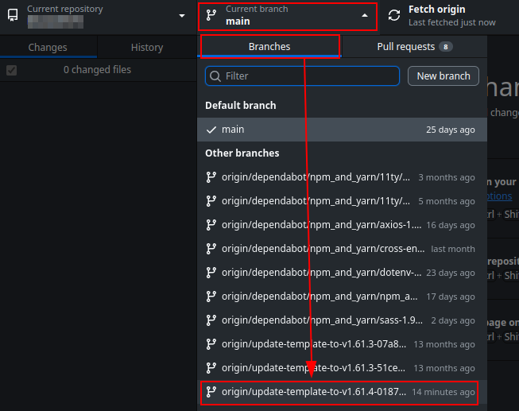
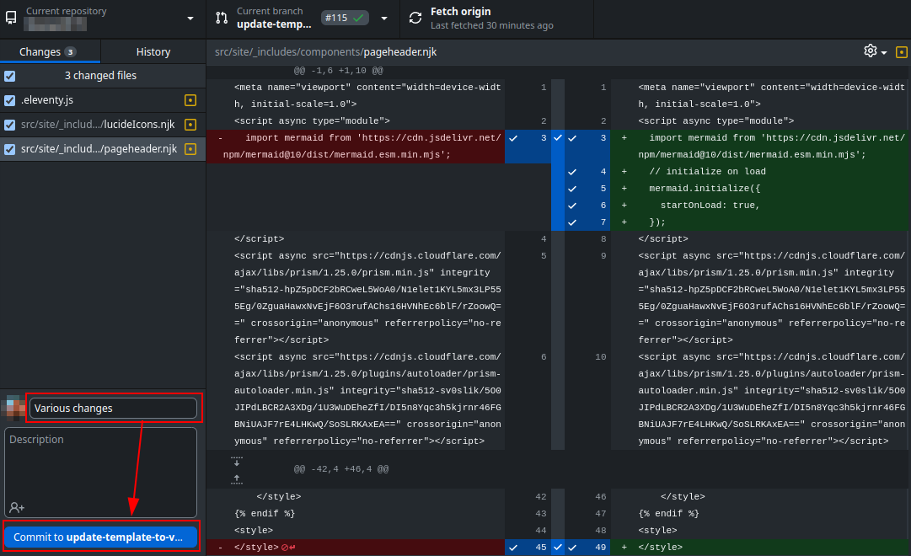
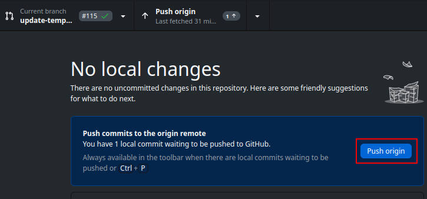
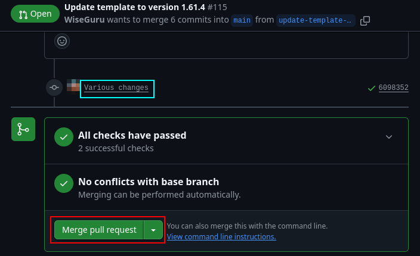

# Maintaining Site Customizations Across DG Template Updates
{: .no_toc}

When Ole releases updates to the Digital Garden template, out-of-band modifications that you've made may be overwritten. However, you can use GitHub Desktop to review the changes being made in the template update and undo or modify those changes.

{: .reminder}
> The Digital Garden plugin compares your repo against the official one, and any unofficial changes you make will cause it to prompt you to update your site template. Double-check the template release date to ensure you're not applying the same update over and over.

## Table of Contents
{: .no_toc .text-delta}
1. TOC
{:toc}

# How to Change Existing PRs
This guide assumes you have an otherwise working site, have downloaded/installed/configured [GitHub Desktop](https://desktop.github.com/download/) to view your repository, and have a basic working knowledge of your computing environment.

To ensure we don't lose any data accidentally during this process, we first take a backup of the current version of the site, then create the template update pull request (PR), open that PR with GitHub Desktop to make the changes we want to make, push the changes to the PR, then merge the changes from the PR with the main branch.

## Step 1. Backup Your Garden

Backing up your Garden can be done in a few different ways, but downloading it as a ZIP is one of the easiest, fastest, and most fool-proof ways to do it.

1. Log into GitHub and navigate to your Digital Garden repository
2. From the repo homescreen, click on the green "Code" button at the top-left corner of the list of files
3. Click "Download ZIP" and save it to your computer where you can easily access it (e.g., the Downloads folder)

## Step 2. Create the Template PR with Obsidian
Before creating the template PR, it's recommended to update the Digital Garden plugin in Obsidian.

### Update the Plugin
1. Open Obsidian, then ensure you're in your Digital Garden vault at the bottom-left of your screen.
2. Click on the Settings gear at the bottom left, then select "Community plugins" from the left menu
3. Select "Check for updates" above the list of plugins, then select either "Update all" to update all plugins, or scroll down to Digital Garden and select "Update" to update just the Digital Garden plugin

### Create the Template PR
1. Now, from the Obsidian Settings menu, select "Digital Garden" under "Community plugins"
	1. You can also click on the gear icon next to the Digital Garden plugin in the "Community plugins" page instead
2. Scroll to the bottom for the "Update site" section and select "Update to x.y.z"
3. In the "Update site" pop-up, select "Create PR" to automatically generate a PR.

## Step 3. Review the PR Changes

After creating the PR, the plugin will display a link you can click to approve the PR.[^1] However, once you click the link, navigate over to the *Files changed* tab to check for anything you want to change.

On the left you have the list of files being changed, and on the right you have each file with all changes being made to them.

1. This is the list of files that are being modified in this pull request.
	1. Clicking on a file will take you to the "diff" or change view between the old and new files.
2. This is the file whose changed code is being displayed, along with the number of lines of code being modified.
3. The red section indicates lines that are being removed
4. The green section indicates lines that are being added
	1. Specific changes to those lines are also highlighted in red or green, like the two `false` values in the red section.

## Step 4. Open the PR in GitHub Desktop and Change the Necessary Files
Open GitHub Desktop and choose your Digital Garden repo from the "Current repository" dropdown menu.

Then, select "Current branch," and under the "Branches" tab, select the "update-template-to-..." that was just created. You'll note that in the screenshot, there are other template updates from 13 months ago; make sure you've got the right one selected.

From here, it depends on what you want to do; you may want to reject all changes to a file, or just tweak them.

### Replace files
1. Extract the files from the zipped archive we created in **Step 1**
2. Click on "Show in File Manager" from GitHub Desktop to open the locally-cloned branch.
3. Drag and drop any files you want to keep in their entirety from the extracted folder and into the cloned branch folder, overwriting existing files when prompted.

### Tweak files
1. From GitHub Desktop, click on "Open in (your IDE of choice)"
2. Navigate to the files you want to change, make your changes, and save them.

## Step 5. Commit and Merge Changes to the PR
Once you're done, commit the changes in GitHub Desktop and merge them in the cloud.

{: .warning}
> Once you are done making changes to the PR, make sure to change your branch back to `main`

Back on GitHub for the Template PR, check the diff files to make sure everything looks correct. Then, click on the "Conversation" tab, then scroll down and select "Merge pull request" to merge the template changes with your garden.

---

[^1]: You can also go to the repo manually and go to the "Pull requests" tab at the top, then chose the appropriate "Update template to version x.y.z" PR.
