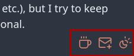

# Floating Buttons and Automatic Theme Switcher
{: .no_toc}

This relatively simple component requires two scripts; a `theme-switcher` Nunjucks script in the `src/site/_includes/components/user/common/footer` folder, and then some custom CSS added to `custom-style.scss`. This will add a floating group of buttons to the bottom-right of your site.

## Table of Contents
{: .no_toc .text-delta}
1. TOC
{:toc}

# How to {topic} 
Describe each step with screenshots, using language aimed at a new user of Obsidian and the digital garden plugin. Explain why a Step needs to be taken, where appropriate. 

## Step 1. Create the `theme-switcher.njk`
Create a new file named `theme-switcher.njk` in `src/site/_includes/components/user/common/footer`. Then open the file and paste in the following script, adjusting the links and email address as appropriate for you.



<aside id="floating-control">
{# Ko-Fi/BuyMeACoffee Link #}
  <a
    id="coffee-link"
    href="https://ko-fi.com/yourlink"
    target="_blank"
    rel="noopener noreferrer"
    title="Buy me a coffee- thank you!"
  >
    <i icon-name="coffee" aria-hidden="true"></i>
  </a>
{# Email Me Link #}
  <a
    id="emailme"
    href="#"
  >
    <i icon-name="mail-plus" title="Discuss" aria-hidden="true"></i>
  </a>
{# Theme Switching Link #}
  
    <i class="svg-icon light" icon-name="sun" aria-hidden="true"></i>
    <i class="svg-icon dark" icon-name="moon" aria-hidden="true"></i>
    <i class="svg-icon auto" icon-name="sun-moon" aria-hidden="true"></i>
  
</aside>




## Step 2. Append `custom-style.scss`
Add the following to the end of the file `custom-style.scss` found in `src/site/styles`.




/* Floating theme switcher */
#floating-control {
  position: fixed;
  color: var(--link-color);
  bottom: 1vmax;
  right: 1vmax;
  font-size: 24px;
  z-index: 999999;
  display: flex;
  flex-direction: row;
  justify-content: flex-end;
  gap: 10px;

  .svg-icon,
  i {
      cursor: pointer;
      height: 24px;
      width: auto;
  }

  #theme-switch {
      .light {
          display: none;
      }

      .dark {
          display: none;
      }

      .auto {
          display: none;
      }
  }

  #theme-switch.light {
      .light {
          display: inline;
      }
  }

  #theme-switch.dark {
      .dark {
          display: inline;
      }
  }

  #theme-switch.auto {
      .auto {
          display: inline;
      }
  }
}



# Related 
- [Paolo Gabriel - website stack](https://www.paologabriel.com/swamp/website-stack/#custom-footer-theme-switcher)
	- Original guide for creating the theme switcher.

---