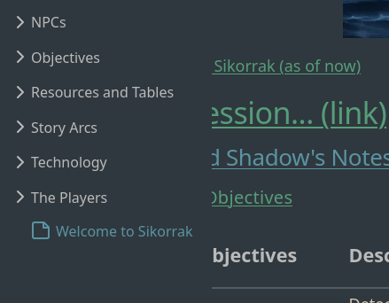

# Modify Digital Garden Body `max-width`
{: .no_toc}

By default, your Digital Garden has a max-width for the body of `700px`. However, you can easily change the max-width (and other sizing settings) of your Digital Garden by modifying some CSS code.

{: .alert-title}
> Work in Progress
> 
> This will cause elements in the page to overlap and overrun at certain window widths, so make sure to test your settings on different browser widths and devices.
> 
> Additionally, if you find a better way to update the page width, please make a suggestion in the comments below or submit an issue/PR for this doc!

## Table of Contents
{: .no_toc .text-delta}
1. TOC
{:toc}

# How to Modify Body Width
You can find most of the Digital Garden-specific CSS code under `src/site/styles/digital-garden-base.scss`. If you want to change more than the `max-width` component of the body text of your site, you should check there first and experiment. Be aware that any changes to that file will be overwritten when the template is updated.
## Step 1. Create `custom-style.scss` and enter in code
Create (or open) the file `src/site/styles/custom-style.scss` in your editor of choice, then copy and paste the following text.



body {
.content {
    max-width: 700px;
    margin: auto;
    font-size: 18px;
    line-height: 1.5;
    margin-top: 90px;
    position: relative;

    @media (max-width: 800px) {
        margin-top: 75px;
    }
}
}



Change `max-width: 700px` to whatever width you would like. Again, be aware that a wide setting (like 1200px) will case overlapping at some widths.

## Step 2. Push changes and check with a new Incognito browser session
Save and commit your changes, and wait for the site to publish. You will likely want to use an incognito browser to check and verify the results since most modern browsers cache CSS information, meaning that just refreshing the page won't reflect your changes.

## Linked Issues and Pull Requests
All bugs and fixes should be linked to existing Pull Requests or Issues with the template or the plugin.

### Issues
- [big gap on left side when filetree is off. · Issue #134 · oleeskild/digitalgarden](https://github.com/oleeskild/digitalgarden/issues/134#issuecomment-1650682430)

---