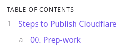

# Syntax and Style Guide
This site uses a slightly different version of Markdown than Obsidian, and there are some key differences in how files are formatted

## Editing in Obsidian
To edit the files in this repository in Obsidian, clone the repo to your computer[^2] then open the folder as a vault in Obsidian.

Once the vault is open, I recommend the following changes:
1. Files and Links
	1. **Automatically update internal links**: Toggled on
	2. **Default location for new notes**: Same folder as current file
	3. **New link format**: Relative path to file
	4. **Use `[[Wikilinks]]`**: Toggled off
	5. **Default location for new attachments**: In the folder specified below
	6. **Attachment folder path**: assets/images
2. Community plugins
	1. [Auto Link Title](https://github.com/zolrath/obsidian-auto-link-title) by Matt Furden
	2. [Paste image rename](https://github.com/reorx/obsidian-paste-image-rename) by Reorx

## Frontmatter
The following frontmatter should be included in all documents:

```
title:            # The readable title of the document
layout: default   # Leave as default
parent:           # The title of the parent document, used in ToC's 
nav_order:        # The position this document should appear in lists
```

`nav_order` prioritizes lower numbers to be higher in the list. If the nav_order matches, then it *should* sort alphabetically, but order may change for unknown reasons.

By default for most posts, `nav_order` should be set to `50` to ensure adequate space for prioritization and growth.

`nav_order` for index.md pages allow you to set the order for folders; the actual homepage should always be `0`, and other folders should be separated by increments of 10.

Other relevant frontmatter properties are listed below:
1. `nav_exclude`
	1. Boolean property
	2. Designates whether it's published (`false`) or unpublished (`true`)
## Folders, File names, Titles, and Headers
### Folders and index.md
Each folder should have a short summary document named "index.md" that describes the folder contents. All other notes in the folder should list that file's title as the parent so that they appear in the Table of Contents automatically generated at the bottom of the file.

### Naming conventions
File names should be all lower-case with hyphens between words. Use the `title` property in the frontmatter and a Header 1 in the first line of the document to set the readable title of the document.

The name of the `index.md` file in a folder should match the readable folder name.

### Headers
The page title should be "Header 1" and the first line of a document after the frontmatter.

```
# Header 1
Some text
## Header 2
Some text
### Header 3
Some text
#### Header 4
Some text
##### Header 5
Some text
###### Header 6
Some text
```


## Table of Contents
Creating a Table of Contents is pretty simple, and is described [Just the Docs - In-Page Navigation](https://just-the-docs.github.io/just-the-docs/docs/navigation/in-page/#generating-table-of-contents). Basically, there are a few tags to be aware of.

- `{: .no_toc}` 
	- Placed after a header to exclude it from the table of contents
- `{:toc}`
	- Immediately follows the first line of an ordered or unordered list to generate a ToC
	- The first line of that list must also have "TOC" as the only text
	- There can only be one `{:toc}` tag per document


```
# In-Page Navigation
{: .no_toc }

## Table of Contents
{: .no_toc .text-delta }

1. TOC
{:toc}

```

{: .warning}
> Make sure that you use `{:toc}` and not `{: .toc}`, or it won't work.

`{: .text-delta}` is a CSS type scale that matches an H4 header, as described in [Just the Docs - Typography](https://just-the-docs.github.io/just-the-docs/docs/ui-components/typography/#responsive-type-scale). In the example above, it converts the H2 header of "Table of Contents" to look like an H4 header.



## Images
Images should be stored in `assets/images` for easier management.

Embedded images must linked to the exact folder from the current location; for example, linking to a file in `/assets/images` from `/Folder1` would require the path `../assets/images/picture.jpg`

Below is not a great example because the syntax guide as at the root of the repo, but here's what it looks like:

``


## Callouts
Callouts are written following the [Just the Docs - Callouts](https://just-the-docs.github.io/just-the-docs/docs/ui-components/callouts/) documentation. This site has the following defined callouts:

1. warning
	1. red
2. tip
	1. yellow
3. success
	1. green
4. reminder
	1. blue
5. note
	1. blue
6. example
	1. purple

### Callout Formatting
Use braces to indicate what kind of callout you're using, and then greater-than symbols for text.

Always make sure there is one empty line between the callout and the next piece of text; failure to do so will include the subsequent line in the callout.

{: .tip}
> My text.

```
{: .tip}
> My text.
```

Append the callout type with "-title" to convert the first line into the title for the callout.

{: .warning-title}
> This is the title
> 
> This is the text.

```
{: .warning-title}
> This is the title
> 
> This is the text
```

Paragraphs must be separated with a full line break.

{: .note-title}
> This is the title
> 
> This is the first paragraph
> 
> This is the second paragraph

```
{: .note-title}
> This is the title
> 
> This is the first paragraph
> 
> This is the second paragraph
```

## Footnotes
Footnotes should use the following formatting as the link, and then as the linked text
Link: `[^(1, 2, 3, etc.)]`
Linked text: `[^(1, 2, 3, etc.)]: Linked text`

This is some text with a footnote.[^1]


----

[^1]: This is the linked text in the footnote.

[^2]: Using GitHub Desktop or Git.
