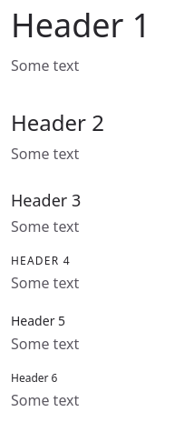
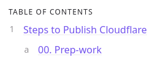
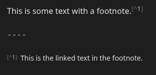
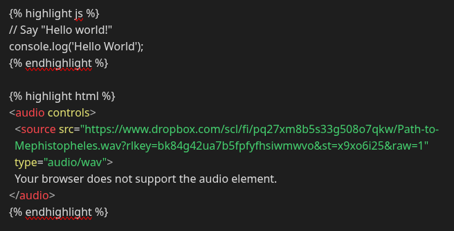
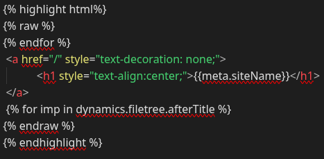
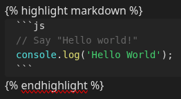
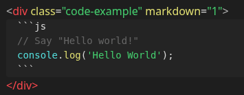

# Syntax and Style Guide
{: .no_toc }

This site uses a slightly different version of Markdown than Obsidian, and there are some key differences in how files are formatted

## Table of Contents
{: .no_toc .text-delta }

1. TOC
{:toc}

## Editing in Obsidian
To edit the files in this repository in Obsidian, clone the repo to your computer[^1] then open the folder as a vault in Obsidian.

The settings in Obsidian are not synchronized with GitHub, so it's important to ensure the following is enabled:

Once the vault is open, I recommend the following changes:
1. Files and Links
	1. **Automatically update internal links**: Toggled on
	2. **Default location for new notes**: Same folder as current file
	3. **New link format**: Relative path to file
	4. **Use `[[Wikilinks]]`**: Toggled off
	5. **Default location for new attachments**: In the folder specified below
	6. **Attachment folder path**: assets/images
2. Community plugins
	1. [Auto Link Title](https://github.com/zolrath/obsidian-auto-link-title) by Matt Furden
	2. [Paste image rename](https://github.com/reorx/obsidian-paste-image-rename) by Reorx
	3. [Dataview](https://github.com/blacksmithgu/obsidian-dataview) by blacksmithgu
		1. This is specifically for the "Malformed Pages" table which looks for pages with formatting problems.
		2. **Dataview is not supported by Jekyll**

Once you have finished adding or updating your documents, you can push the changes back up into GitHub for review and publication. As a reminder, your Obsidian Vault settings will not synchronize.

## Frontmatter
The following frontmatter should be included in all documents:

<div class="code-example" markdown="1">
```
title:            # The readable title of the document
layout: default   # Leave as default
parent:           # The title of the parent document, used in ToC's 
nav_order:        # The position this document should appear in lists
```
</div>


`nav_order` prioritizes lower numbers to be higher in the list. If the nav_order matches, then it *should* sort alphabetically, but order may change for unknown reasons.

By default for most posts, `nav_order` should be set to `50` to ensure adequate space for prioritization and growth.

`nav_order` for index.md pages allow you to set the order for folders; the actual homepage should always be `0`, and other folders should be separated by increments of 10.

Other relevant frontmatter properties are listed below:
1. `nav_exclude`
	1. Boolean property
	2. **This does not say whether the page is published, just if it's listed on the site**
	3. Designates whether it's listed on the site (`false`) or not (`true`)

## Folders, File names, Titles, and Headers
### Folders and index.md
Each folder should have a short summary document named "index.md" that describes the folder contents. All other notes in the folder should list that file's title as the parent so that they appear in the Table of Contents automatically generated at the bottom of the file.

### Naming conventions
File names should be all lower-case with hyphens between words. Use the `title` property in the frontmatter and a Header 1 in the first line of the document to set the readable title of the document.

The name of the `index.md` file in a folder should match the readable folder name.

{: .warning-title}
> Titles for Works in Progress
> 
> Files that are works in progress (and are not intended to be published yet) **should** begin with "WIP" in the file name, **should not** have the `title` property set, and **should** have `nav_exclude` set to *true*.
> 
> Remember, however, that these documents will be public, just more difficult to find; **never commit/push information not intended for public availability.**

### Headers
The page title should be "Header 1" and the first line of a document after the frontmatter. Other headers can be 



# Header 1
Some text
## Header 2
Some text
### Header 3
Some text
#### Header 4
Some text
##### Header 5
Some text
###### Header 6
Some text





Headers can also be linked to using the traditional bracket/parenthesis links. If using Obsidian with the settings described earlier, entering double-bracket/hashtag and selecting the header from the dropdown will format the link, but you will need to set the header as lower-case and sluggified (hyphens for spaces).



[Headers](#headers)
[Table of Contents](#table-of-contents)



[Headers](#Headers)
[Table of Contents](#table-of-contents)

## Table of Contents
Creating a Table of Contents is pretty simple, and is described [Just the Docs - In-Page Navigation](https://just-the-docs.github.io/just-the-docs/docs/navigation/in-page/#generating-table-of-contents). Basically, there are a few tags to be aware of.

- `{: .no_toc}` 
	- Placed after a header to exclude it from the table of contents
- `{:toc}`
	- Immediately follows the first line of an ordered or unordered list to generate a ToC
	- The first line of that list must also have "TOC" as the only text
	- There can only be one `{:toc}` tag per document




# In-Page Navigation
{: .no_toc }

## Table of Contents
{: .no_toc .text-delta }

1. TOC
{:toc}




{: .warning}
> Make sure that you use `{:toc}` and not `{: .toc}`, or it won't work.

`{: .text-delta}` is a CSS type scale that matches an H4 header, as described in [Just the Docs - Typography](https://just-the-docs.github.io/just-the-docs/docs/ui-components/typography/#responsive-type-scale). In the example above, it converts the H2 header of "Table of Contents" to look like an H4 header.



## Images
Images should be stored in `assets/images` for easier management.

Embedded images must linked to the exact folder from the current location; for example, linking to a file in `/assets/images` from `/Folder1` would require the path `../assets/images/picture.jpg`

Below is not a great example because the syntax guide as at the root of the repo, but here's what it looks like:

``


## Callouts
Callouts are written following the [Just the Docs - Callouts](https://just-the-docs.github.io/just-the-docs/docs/ui-components/callouts/) documentation. Use braces to indicate what kind of callout you're using, and then greater-than symbols for text.

Always make sure there is one empty line between the callout and the next piece of text; failure to do so will include the subsequent line in the callout.

<div class="code-example" markdown="1">
```
{: .attention}
> My text.
```
</div>

{: .attention}
> My text.

This site has the following defined callouts:

{: .warning}
> Warning example

{: .hint}
> Hint example

{: .important}
> Important example

{: .note}
> Note example

{: .tip}
> Tip example

{: .caution}
> Caution example

{: .error}
> Error example

{: .attention}
> Attention example

Append the callout type with "-title" to convert the first line into the title for the callout.

<div class="code-example" markdown="1">
```
{: .warning-title}
> This is the title
> 
> This is the text
```
</div>

{: .warning-title}
> This is the title
> 
> This is the text.

Paragraphs must be separated with a full line break.

<div class="code-example" markdown="1">
```
{: .tip-title}
> This is the title
> 
> This is the first paragraph
> 
> This is the second paragraph
```
</div>

{: .tip-title}
> This is the title
> 
> This is the first paragraph
> 
> This is the second paragraph

## Footnotes
Footnotes should use the following formatting as the link, and then as the linked text
Link: `[^(1, 2, 3, etc.)]`
Linked text: `[^(1, 2, 3, etc.)]: Linked text`

Before the linked text in the foot notes, include a line break with `---` or `----`.

This is some text with a foot note. [^2]

 


## Codeblocks
Codeblocks with syntax highlighting must be wrapped using either Jekyll's highlight syntax[^3] or HTML, as demonstrated and discussed in the [JTD official docs](https://just-the-docs.github.io/just-the-docs/docs/ui-components/code/).

If you use Obsidian as your editor, there is a codeblock template for you in the templates folder, and it includes the `raw/endraw` described below.

### Jekyll
Jekyll's syntax highlighting is the least-janky way to highlight code. Jekyll supports a wide-range of languages for syntax-highlighting, described here and elsewhere: [Supported syntax highlighting in Jekyll - Fabrizio Musacchio](https://www.fabriziomusacchio.com/blog/2021-08-11-Syntax_Highlighting_in_Jekyll/)[^4] 

Unfortunately, it does not support Nunjucks, though there may be a workaround we can implement in the future.[^5]

Examples:




// Say "Hello world!"
console.log('Hello World');



<audio controls>
  <source src="https://www.dropbox.com/scl/fi/pq27xm8b5s33g508o7qkw/Path-to-Mephistopheles.wav?rlkey=bk84g42ua7b5fpfyfhsiwmwvo&st=x9xo6i25&raw=1" type="audio/wav">
  Your browser does not support the audio element.
</audio>



#### Nunjucks
If your codeblock has nunjucks tags (the percentiles and squiggly-brackets), you **must** use the "raw" tags so that it is not rendered by Jekyll.






 <a href="/" style="text-decoration: none;">
	   <h1 style="text-align:center;">{{meta.siteName}}</h1>
 </a>
 




### Codeblock formatting you probably shouldn't use

#### Wrapping backticks

You can also wrap normal codeblocks using the Jekyll `highlight` tag; you just need to identify the language as "markdown" in the tag.




```js
// Say "Hello world!"
console.log('Hello World');
```


This should probably be avoided so that when people copy/paste the contents of the codeblock, they aren't copying the markdown codeblock syntax.

#### HTML tags
`<div>` codeblocks are generally less optimal, but are included here for completeness. The first line should read `<div class="code-example" markdown="1">`, and the last line closes the tag with `</div>`

For example, this formatted code:



Looks like this:

<div class="code-example" markdown="1">
```js
// Say "Hello world!"
console.log('Hello World');
```
</div>

HTML tags should be avoided because they add unnecessary whitespace around the codeblock.


----

[^1]: Using GitHub Desktop or Git.

[^2]: This is the linked text in the footnote.

[^3]: [Tags Filters \| Jekyll • Simple, blog-aware, static sites](https://jekyllrb.com/docs/liquid/tags/)

[^4]: [List of supported languages and lexers · rouge-ruby/rouge Wiki · GitHub](https://github.com/rouge-ruby/rouge/wiki/List-of-supported-languages-and-lexers)

[^5]: [Nunjucks / \*.njk syntax highlighting · helix-editor/helix · Discussion #5740 · GitHub](https://github.com/helix-editor/helix/discussions/5740)
